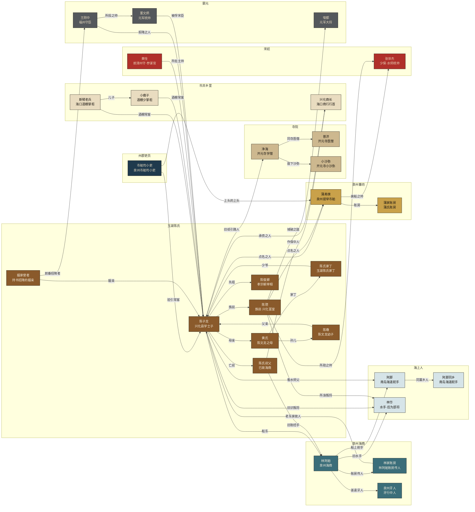
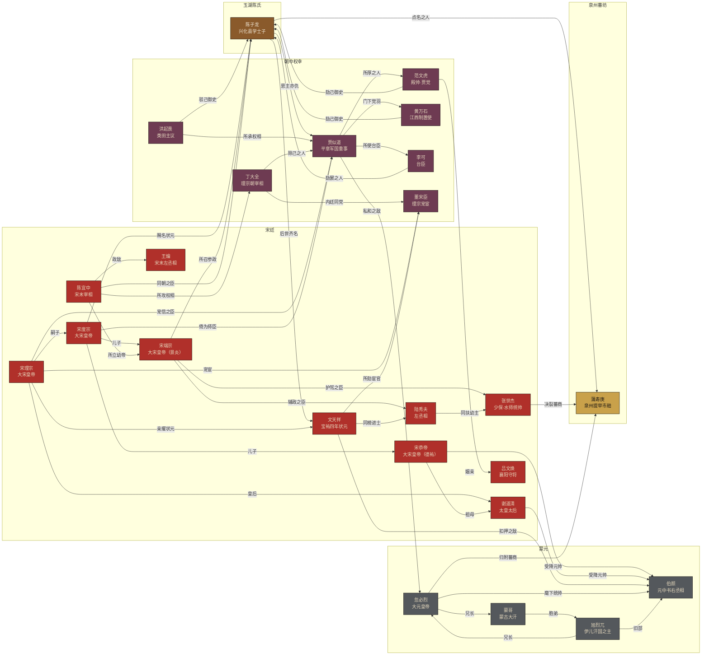

# 角色设定集（2026-09-25）

> 《东亚海域立志传》全部出场人物的身份、属性、特技、性格、小传、台词与立绘槽。
> 权威数据：`data/characters.json`（本文与之逐条同步，改人物请先改 JSON）。属性只作展示与叙事，**不改任何玩法数值**。
> 史实口径以 `docs/陈文龙史料调研_2026-09-04.md` 为准；台词中的史实原句逐字用原文，其余为本作拟写。

## 一、总览

| 分层 | 人数 | 说明 |
|---|---|---|
| 主角 | 1 | 玩家本人：陈子龙 / 陈文龙 |
| 主要人物 | 7 | 推动主线的 NPC（含 npcs.json 中有剧情职能者与母亲黄氏） |
| 船上职事（可雇） | 18 | crew.json 18 名可雇职事，属性按职事与 level 自洽 |
| 次要人物 | 14 | 有台词或剧情动作的次要人物（含 Main.gd 硬编码的市舶司小吏） |
| 史实人物（传闻与史事） | 35 | 新闻、短札、序章沙盘与终局素材库中出现的史实人物 |
| **合计** | **75** | 立绘 75 张全部入库：油画 18，「绢本墨影」兜底卡 57（待出油画） |

章节编号：0＝序章，1–4＝`chapters.json` 四章（海口 / 旧账 / 纲首 / 南海），5＝终局（1275 年十二月起）。

## 二、阵营

| 阵营 | 色 | 色块字色 | 人数 | 人物 |
|---|---|---|---|---|
| 玉湖陈氏 | `#8a5a2b` | `#f7f0e0`（5.2:1） | 11 | 陈子龙、陈氏叔父、兴化来人、陈瓒、黄氏、陈氏家丁、姻家使者、陈俊卿、陈璥、仲子、陈粢 |
| 宋廷 | `#b0302a` | `#e9dcc0`（4.7:1） | 14 | 黄恮、文天祥、张世杰、陆秀夫、吕文焕、赵溍、宋理宗、宋度宗、宋恭帝、宋端宗、谢道清、陈宜中、王爚、岳飞 |
| 朝中权幸 | `#6e3b52` | `#e9dcc0`（6.4:1） | 7 | 贾似道、范文虎、黄万石、李可、洪起畏、董宋臣、丁大全 |
| 蒙元 | `#54585c` | `#e9dcc0`（5.3:1） | 8 | 董文炳、唆都、王刚中、王世强、伯颜、忽必烈、蒙哥、旭烈兀 |
| 泉州蕃坊 | `#c9a14a` | `#1a1612`（7.4:1） | 4 | 蒲家账房、施那帏、蒲阿烈、蒲寿庚 |
| 泉州海商 | `#3b6e7a` | `#f7f0e0`（5.0:1） | 5 | 林阿舶、林家账房、泉州牙人、王直库、黄账房 |
| 海上人 | `#d6e4e8` | `#1a1612`（13.8:1） | 8 | 阿那、林华、吴针、蔡七星、阿那同乡、林阿五、陈老舵、何抢风 |
| 寺院 | `#cdb88f` | `#1a1612`（9.3:1） | 4 | 净海、小沙弥、净海记名沙弥、普济 |
| 州郡吏员 | `#1f3a4d` | `#e9dcc0`（8.7:1） | 3 | 市舶司小吏、叶市舶、曹澄孙 |
| 市井乡里 | `#e9dcc0` | `#1a1612`（13.2:1） | 8 | 断臂老兵、小瘸子、车夫、石手军头目、兴化商长、周算筹、吴医人、孙巧手 |
| 异国客 | `#7d8a5c` | `#1a1612`（4.8:1） | 3 | 近藤三郎、金耽罗、北条时赖 |

色块字色按 WCAG 对比度实测挑选，均 ≥4.5:1。海上人、市井乡里、寺院、泉州蕃坊四色很浅，放在宣纸底（#e9dcc0）上与底色对比仅 1.0–1.8:1，做 UI 色块时一律加 1px 焦墨 #0d0b09 描边。

阵营按人物**主要身份**归属，不预告结局：林华始终记在「海上人」（雇他时不剧透叛降），王刚中、王世强这类以降元身份入戏的归「蒙元」。

## 三、人物关系总览

关系字段的读法统一为「对方之于我」：箭头 `A →〔母亲〕→ B` 读作「A 的母亲是 B」；亲属与同榜、同降等双向关系只画一条。颜色即阵营色。

### 3.1 海与岸：主角身边的人

### 3.2 朝堂与天下：新闻里的人

## 四、属性与特技定义

| 属性 | 含义 |
|---|---|
| 航术 `hang` | 观星辨风、识水色礁线、把舵行船的本事。 |
| 商才 `shang` | 算账议价、分舱理货、识货与经营信用。 |
| 武勇 `wu` | 弓弩刀枪、临阵胆气与统兵之能。 |
| 学识 `xue` | 经史文章、律令典故、医药与杂学。 |
| 人望 `wang` | 在宗族乡里、士林同僚与市井间的信望和号召力。 |

职事属性口径：主项按 level 取值，L1≈50–60、L2≈68–76、L3≥82（火长/舵工看航术，总管/杂事看商才，通事看学识与人望，医人看学识）。主角属性为 1255 年开局状态：学识高、航术低。

| 特技 | 名目 | 说明 | 持有者 |
|---|---|---|---|
| `qianxing` | 牵星 | 夜观星斗高低定船位，晦夜不失道。 | 蔡七星 |
| `guanyun` | 观云 | 望云气、听潮声，预断风雨与季风转向。 | 阿那、蔡七星、阿那同乡、陈老舵、何抢风 |
| `zhenlu` | 针路 | 熟记针经，掌指南浮针，诸港方位了然于胸。 | 陈氏叔父、吴针、蔡七星 |
| `gouni` | 钩泥 | 以长绳铅锤钩取海底泥，嗅色辨沙，便知船到何处（《萍洲可谈》）。 | 阿那、阿那同乡 |
| `caozhou` | 操舟 | 把舵抢风、调戗逆行，风大时不慌。 | 阿那、林华、林阿五、陈老舵、何抢风、张世杰 |
| `fencang` | 分舱 | 水密隔舱分贮诸商之货，垫舱防潮，货损少。 | 林阿舶、王直库、施那帏 |
| `suanchou` | 算筹 | 精于筹算账簿，抽解、脚钱、分摊一笔不错。 | 陈氏叔父、林阿舶、陈瓒、市舶司小吏、蒲家账房、林家账房、泉州牙人、兴化商长、施那帏、周算筹、黄账房、叶市舶、蒲寿庚、贾似道、洪起畏 |
| `fanyu` | 蕃语 | 通大食、占城、倭、高丽诸蕃言语，能居间成交。 | 蒲家账房、施那帏、叶市舶、蒲阿烈、近藤三郎、净海记名沙弥、金耽罗、蒲寿庚 |
| `bianyao` | 辨药 | 识药性、备药石，能治瘴疠、脚气与齿血之症。 | 普济、吴医人、孙巧手 |
| `gongnu` | 弓弩 | 善弓弩刀牌，临阵有胆。 | 陈瓒、林华、断臂老兵、张世杰、董文炳、唆都、吕文焕、伯颜、忽必烈、蒙哥、旭烈兀、岳飞 |
| `shuizhan` | 水战 | 通舟师阵法，能结船为阵、拒敌于海上。 | 蒲寿庚、张世杰、董文炳、范文虎、伯颜 |
| `shiwen` | 诗文 | 能文章、工诗赋，经义策论俱佳。 | 陈子龙、兴化来人、净海、黄恮、周算筹、近藤三郎、文天祥、陆秀夫、贾似道、陈俊卿、北条时赖、宋理宗、陈宜中 |
| `jinshi` | 金石 | 辨碑版字迹与纸背押记，精于拓印。 | 净海、净海记名沙弥 |
| `zhijian` | 直谏 | 敢言人所不敢言，风骨峻直，不肯呈稿于权门。 | 陈子龙、文天祥、陈俊卿 |

## 五、立绘状态

75 张立绘全部在 `assets/portraits/<id>.png`（512×640），由 `tools/art/build_portraits.py` 一键生成：油画从 Codex / main 旧画逐张修瑕落地，其余人物生成同规格的「绢本墨影」兜底卡（旧绢底、焦墨冠服剪影、马善政竖排姓名、朱砂阵营印），出油画后直接覆盖同名文件。

| 人物 | id | 状态 | 来源 | 选角理由 | 残留瑕疵 / 优先级（portrait_note） |
|---|---|---|---|---|---|
| 陈子龙 | `chen_wenlong` | 油画 | `codex:portrait_chen_wenlong.png` | 青年士子手持《春秋》；另有 main:avatar_chen.png 全身像可作全身场景备用。 | — |
| 兴化来人 | `xinghua_messenger` | 油画 | `codex:portrait_linan_passerby.png` | 风帽褐衫、警觉回望，贴合「话少谨慎、衣摆沾泥」。 | — |
| 净海 | `monk_jinghai` | 油画 | `codex:portrait_old_monk.png` | 老僧捻珠、神态克制。 | 樱花、和式寺檐、石灯笼已换成虚化的暮色背景，袈裟上的家纹式团纹已盖掉；面相与袈裟形制仍偏日式禅僧。【P1 重绘】 |
| 林阿舶 | `merchant_lin` | 油画 | `codex:portrait_mingzhou_merchant.png` | 东坡巾式高帽、捧线装货账、精明笑，合「账认人」。 | 灯笼「処」、陶罐「銘酒」、竖招牌「千客萬来」等日文用字已补成素面（保留灯笼「酒」字）；酒肆陈设仍带和风，人物略年轻于设定。【P1 重绘】 |
| 阿那 | `pilot_ana` | 油画 | `main:sprite_ana.png` | 红缠头、短刀、湿衣，就是为阿那画的。 | sprite_ana 的紫色皮肤已按亮度重映射为日晒古铜，并做厚涂化、去画框、4:5 裁切；底稿是硬线数码插画，笔触与 Codex 厚涂仍有差别。【P1 重绘】 |
| 林华 | `lin_hua` | 油画 | `codex:portrait_patrol_soldier.png` | 铁札甲部将，对应 1276 年林华；沙盒期水手阶段亦沿用（伏笔）。 | — |
| 黄恮 | `huang_quan` | 油画 | `codex:portrait_jiaozhi_temple_keeper.png` | 白须慈和，贴合「温和笃定」。 | 胸前绣片近明式补子，头巾近明式方巾。【P3 可选重绘】 |
| 市舶司小吏 | `customs_official` | 油画 | `codex:portrait_customs_official.png` | 身份与 Codex「市舶司小吏」完全对应。 | 明式凤纹补子与左胸一列盘扣已抹去；清式立领、短翅乌纱仍在，与 look 的展脚幞头、圆领公服不符。【P1 重绘】 |
| 断臂老兵 | `veteran` | 墨影兜底卡 | `none` |  | 旧图 main:sprite_veteran.png 画成双手俱全、捧青花碗，与「断臂」设定正面冲突，弃用；现为独臂剪影的墨影兜底卡。【P1 待出油画】 |
| 小瘸子 | `veteran_son` | 油画 | `codex:portrait_tavern_guest.png` | 酒肆里比画讲消息的神态正合「小瘸子」；半身像不露腿。 | — |
| 陈氏家丁 | `chen_servant` | 油画 | `main:sprite_servant.png` | 撑油纸伞跪地，正是序章那一幕；原图带木画框，已去框并按 4:5 裁切。 | — |
| 蔡七星 | `cai_qixing` | 油画 | `codex:portrait_broken_eyebrow.png` | 眉骨旧疤、花白高髻、港口背景，贴合老火长。 | — |
| 阿那同乡 | `ana_tongxiang` | 墨影兜底卡 | `none` |  | 旧图 codex:portrait_ryukyu_pilot.png 是饱和热带蓝天加 CG 画风，与全套不合，弃用；现为墨影兜底卡。【P1 待出油画】 |
| 陈老舵 | `chen_laodao` | 油画 | `codex:portrait_jiaozhi_old_merchant.png` | 港口夕照老人，贴合老舵工。 | 衣襟是清式立领盘扣，与 look「灰青旧交领袍」不符。【P2 可选重绘】 |
| 何抢风 | `he_wenzhou` | 油画 | `codex:portrait_one_finger_sailor.png` | 豁牙大笑、缺指、抱酒坛，贴合「船主不敢用第二次」。 | — |
| 施那帏 | `shi_naowei` | 油画 | `codex:portrait_abbas.png` | 大食裔、立于船舷，贴合蕃客后裔总管。 | 正午蓝天碧海已改为暮色并虚化，右侧绳梯索具与雕花舷栏读不出形制；船仍偏西式横帆。【P2 可选重绘】 |
| 周算筹 | `zhou_suanchou` | 油画 | `codex:portrait_inn_scholar.png` | 伏案执笔的清瘦士子，贴合落第士人。 | — |
| 黄账房 | `huang_zhangfang` | 油画 | `codex:portrait_innkeeper.png` | 抱算盘笑面，贴合牙行出身。 | 头戴明清式六合帽、衣襟盘扣，与 look「皂纱软幞头」不符。【P2 可选重绘】 |
| 叶市舶 | `ye_shibo` | 油画 | `codex:portrait_jeju_official.png` | 怀抱簿籍的旧吏。 | 胸前方形绣片近明式补子；背景有马匹（Codex 原为耽罗官员）。【P2 可选重绘】 |
| 文天祥 | `wen_tianxiang` | 油画 | `codex:portrait_jia_disciple.png` | 「美皙如玉，秀眉长目」的青年士人，对应 1256 年状元时期。 | — |

其余 55 人现为墨影兜底卡，油画提示词见 `docs/立绘生成提示词_2026-09-25.md`：陈氏叔父、陈瓒、黄氏、车夫、石手军头目、蒲家账房、林家账房、小沙弥、泉州牙人、兴化商长、姻家使者、吴针、林阿五、王直库、蒲阿烈、近藤三郎、净海记名沙弥、金耽罗、普济、吴医人、孙巧手、蒲寿庚、张世杰、陆秀夫、贾似道、董文炳、唆都、王刚中、曹澄孙、王世强、陈俊卿、陈璥、仲子、吕文焕、范文虎、赵溍、黄万石、李可、洪起畏、伯颜、忽必烈、蒙哥、旭烈兀、北条时赖、宋理宗、宋度宗、宋恭帝、宋端宗、谢道清、董宋臣、丁大全、陈宜中、王爚、陈粢、岳飞。

## 六、人物分节

### 主角

#### 陈子龙（初字德刚；咸淳四年御赐字君贲） · 兴化县学士子

- **别称**：陈文龙、陈纲首
- **阵营**：玉湖陈氏　**籍贯**：兴化军莆田县玉湖　**生卒**：1232–1277　**史实**：是
- **出场**：序章、一、二、三、四、终局　**来源**：npcs.json `chen_wenlong`；台词署名「陈文龙」　**id**：`chen_wenlong`
- **属性**：航术 18｜商才 32｜武勇 20｜学识 86｜人望 42
- **特技**：诗文（能文章、工诗赋，经义策论俱佳。）；直谏（敢言人所不敢言，风骨峻直，不肯呈稿于权门。）
- **性格**：外温内峻，读书人的硬骨头；拙于风浪，却肯低头学水色。
- **一句话**：兴化玉湖陈氏子弟，丞相陈俊卿五世从孙。宝祐三年，叔父遗债与举业同压案头，海路与科场在他面前分岔。

初名子龙，兴化军莆田玉湖陈氏，孝宗朝丞相陈俊卿五世从孙。宝祐三年（1255）开局时二十三岁，县学出身，策论见长，却连海口防波堤都未曾跨出；叔父借蕃商船资、货沉人亡，五百贯旧债落在他名下。史实中，他宝祐四年入临安太学，咸淳四年殿试第一，度宗御笔改名文龙；任监察御史时独不呈稿于贾似道，两度罢归。景炎元年以参知政事知兴化军，立「生为宋臣，死为宋鬼」旗，城破被执，械送杭州，绝食死于岳王庙前，后世奉为「水部尚书」。本作中，他叫什么名字，要看玩家把船开向哪里。

> 「纸上的利害我写过三个月，船舱里的利害，今夜才头一回见。」
>
> 「叔父的债是真的，我认。只是这押字，须我自己看得懂才签。」
>
> 「此皆节义文章也，可相逼邪？」

- **关系**：黄氏——母亲；陈瓒——族叔；陈氏叔父——亡叔；林阿舶——船东；阿那——看水师父；净海——旧纸引路人；贾似道——恩主亦仇；蒲寿庚——点名之人；林华——旧识叛将；陈俊卿——先祖；文天祥——后世齐名
- **外貌**：二十三岁，清瘦，指有笔茧；束发幅巾，浆洗白麻襕衫或青布直裰，腰系丝绦，袖藏货引；士人线后期绯色公服、展脚幞头。
- **立绘**：油画，来源 `codex:portrait_chen_wenlong.png`。青年士子手持《春秋》；另有 main:avatar_chen.png 全身像可作全身场景备用。 → `res://assets/portraits/chen_wenlong.png`

### 主要人物

#### 净海 · 开元寺学僧

- **别称**：净海师父
- **阵营**：寺院　**籍贯**：泉州　**生卒**：生卒不详　**史实**：否（本作虚构）
- **出场**：一、二　**来源**：npcs.json `monk_jinghai`　**id**：`monk_jinghai`
- **属性**：航术 22｜商才 18｜武勇 10｜学识 84｜人望 66
- **特技**：金石（辨碑版字迹与纸背押记，精于拓印。）；诗文（能文章、工诗赋，经义策论俱佳。）
- **性格**：克制低声，只问字形、石质与纸背押记，不问谁在争路。
- **一句话**：泉州开元寺学僧，掌碑拓经卷与寺院文书往来。一张写着「北礁可泊」的旧纸，把陈子龙引向旧避风澳。

泉州开元寺偏院的学僧，终日与晒经、碑版和拓包为伴。他听得出兴化口音，却只问来人读过哪些碑版。第一章，他移开镇纸，露出半张画着断续海岸的旧纸，旁注「北礁可泊」四字，托陈子龙去复核残碑；第二章兴化来信压上门时，他不拆信，只另写一张给沿海寺社的短札。寺院网络是他的门路，也是他的界限——他从不主动谈兵谈政，只相信字能留下，旧路便不是酒肆里的空话。

> 「若见残碑，取字即可。字能留下，旧路便不是酒肆里的空话。」
>
> 「路若真能通，先要知道谁能收，谁不能看。」
>
> 「这纸背的押记，是乾道年间的，比你我都老。」

- **关系**：陈子龙——托碑之人；小沙弥——座下沙弥；普济——同寺医僧；净海记名沙弥——记名弟子
- **外貌**：年约五旬，光头，白须修剪整齐，眉目温和；灰褐直裰外披金缘褐色袈裟，手捻念珠，袖口沾墨。
- **立绘**：油画，来源 `codex:portrait_old_monk.png`。老僧捻珠、神态克制。 瑕疵：樱花、和式寺檐、石灯笼已换成虚化的暮色背景，袈裟上的家纹式团纹已盖掉；面相与袈裟形制仍偏日式禅僧。【P1 重绘】 → `res://assets/portraits/monk_jinghai.png`

#### 林阿舶 · 泉州海商

- **别称**：林老大、林老爹
- **阵营**：泉州海商　**籍贯**：泉州　**生卒**：？–1274　**史实**：否（本作虚构）
- **出场**：序章、一、二、三、四　**来源**：npcs.json `merchant_lin`；台词署名「林阿舶」　**id**：`merchant_lin`
- **属性**：航术 58｜商才 88｜武勇 30｜学识 45｜人望 70
- **特技**：算筹（精于筹算账簿，抽解、脚钱、分摊一笔不错。）；分舱（水密隔舱分贮诸商之货，垫舱防潮，货损少。）
- **性格**：现实精明，账簿比人情可靠；嘴上不讲义气，账上却留一铺之地。
- **一句话**：蕃坊边开铺的泉州海商，福船东家、叔父旧账的经手人。先问保人再问货：风浪不认人，账认人。

泉州蕃坊外开铺的海商，门口终年堆着藤篮、铅封瓷箱与待晾的油布。叔父那笔蕃商旧账经他的手，他便成了陈子龙下海的第一位东家：不让新手一口气远航博多，只把普通福建瓷、青白瓷、唐房寄物和一纸硫黄旧账分开推到案边。他说话只用账簿、舱位、脚钱与货损分摊，从不讲远方。兴化那封无押信压到他案上时，他不问内文，只推来一张留了空格的货单。咸淳十年前后病故，账房里留着一行红字：「陈子龙，船股一分。」

> 「风浪不认人，账认人。」
>
> 「这趟先验中继路。货不能潮，信不能皱。」
>
> 「若要走这趟，账上不能写信，只能写湿货、空箱、折损。你自己想清楚。」

- **关系**：陈子龙——提携后生；陈氏叔父——旧账主顾；阿那——船上舵手；林家账房——账房传人；林华——旧水手；泉州牙人——差遣牙人
- **外貌**：四十五六，精瘦，八字短须；黑纱高装巾子，深靛暗纹直裰，袖口磨白，腰悬算袋，手不离一册线装货账。
- **立绘**：油画，来源 `codex:portrait_mingzhou_merchant.png`。东坡巾式高帽、捧线装货账、精明笑，合「账认人」。 瑕疵：灯笼「処」、陶罐「銘酒」、竖招牌「千客萬来」等日文用字已补成素面（保留灯笼「酒」字）；酒肆陈设仍带和风，人物略年轻于设定。【P1 重绘】 → `res://assets/portraits/merchant_lin.png`

#### 阿那 · 南岛海道舵手

- **阵营**：海上人　**籍贯**：南岛海道北口（流求）　**生卒**：生卒不详　**史实**：否（本作虚构）
- **出场**：序章、一、二、三、四　**来源**：npcs.json `pilot_ana`；台词署名「阿那」　**id**：`pilot_ana`
- **属性**：航术 82｜商才 20｜武勇 58｜学识 12｜人望 35
- **特技**：观云（望云气、听潮声，预断风雨与季风转向。）；钩泥（以长绳铅锤钩取海底泥，嗅色辨沙，便知船到何处（《萍洲可谈》）。）；操舟（把舵抢风、调戗逆行，风大时不慌。）
- **性格**：冷面寡言，用水色、鸟群和潮声说话；认人不认身份。
- **一句话**：皮肤被海风吹得紫黑、腰掖短刀的年轻舵手，出身南岛海道。教陈子龙自己的缆自己系、追水色不追灯。

南岛海道北口一寨出身的年轻水手，给林阿舶的福船掌舵。序章雨夜，他赤脚踩水冲进兴化海口酒棚，冷冷丢下两条路：带着圣贤书回兴化，或拿上货引去泉州，「林老大的船舱里给你留了一铺之地」。他很少讲道理，只讲水色、鸟群、潮声与铅锤。第一章是他带人抛铅锤、辨沙底，把旧避风澳从传闻变成可复核的泊地。二十年后，陈子龙在崖山火光里、在涵江海口，都还用着他教的看水法子。

> 「莫只看远近。水转青白，底下多沙；潮声若闷，礁线在外头。」
>
> 「接住。海上第一条规矩——自己的缆自己系。」
>
> 「子时三刻。别让林老大等。」

- **关系**：陈子龙——教过的书生；林阿舶——林老大；阿那同乡——同寨乡人
- **外貌**：二十出头，精瘦结实，日晒古铜近黑（原文「紫黑」，非紫色）；红布缠头，靛青短褐外罩破麻背心，腰掖短刀，赤脚。
- **立绘**：油画，来源 `main:sprite_ana.png`。红缠头、短刀、湿衣，就是为阿那画的。 瑕疵：sprite_ana 的紫色皮肤已按亮度重映射为日晒古铜，并做厚涂化、去画框、4:5 裁切；底稿是硬线数码插画，笔触与 Codex 厚涂仍有差别。【P1 重绘】 → `res://assets/portraits/pilot_ana.png`

#### 陈瓒 · 族叔·兴化富室

- **别称**：族叔
- **阵营**：玉湖陈氏　**籍贯**：兴化莆田玉湖　**生卒**：？–1277　**史实**：是
- **出场**：四、终局　**来源**：npcs.json `chen_zan`；台词署名「陈瓒」　**id**：`chen_zan`
- **属性**：航术 28｜商才 80｜武勇 60｜学识 45｜人望 84
- **特技**：算筹（精于筹算账簿，抽解、脚钱、分摊一笔不错。）；弓弩（善弓弩刀牌，临阵有胆。）
- **性格**：话直钱直，先问要多少、走哪条水、几时回；认准了便倾家。
- **一句话**：玉湖陈氏的富室族叔，乡土线的钱与根。兴化陷后倾家起兵、杀林华复城，再败，车裂而死。

兴化玉湖陈氏的富户，陈文龙的族中长辈（《宋史》作从子，《兴化府志》作从叔，本作取从叔）。他谈事从不绕弯，咸淳六年后可入玩家船股一分，是乡土线的经济来源。史实：景炎元年倾家财三百万缗渡海助张世杰；兴化陷落后募乡兵夜袭入城，杀降将林华，一度复城；元将唆都回师再围，四十日城破，被执车裂。本作「岸上的根」里，他守城时把涵江海口那条旧路交给玩家。海商线中，蒲寿庚那句「非不忠义，如民何」点的是他的名字。

> 「要多少、走哪条水、几时回——这三句先说清，钱就是你的。」
>
> 「城守不住了。我不走。我姓陈，我在这里出生，就死在这里。」
>
> 「陈家不能都死在这里。涵江海口有船，带族里的人走。」

- **关系**：陈子龙——族侄；林华——所诛叛将；张世杰——所助之帅；唆都——城破之敌；蒲寿庚——点名之人
- **外貌**：四十上下（1270 年代；史载卒年四十五），方面阔口，须髯浓黑；绛褐绸面褙子内衬白纻衫，头戴高装巾子，腰悬铜鱼钥。
- **立绘**：墨影兜底卡（待出油画） → `res://assets/portraits/chen_zan.png`

#### 林华 · 水手·后为部将

- **别称**：部将林华
- **阵营**：海上人　**籍贯**：泉州　**生卒**：？–1277　**史实**：是
- **出场**：二、三、四、终局　**来源**：npcs.json `lin_hua`；台词署名「部将林华」　**id**：`lin_hua`
- **属性**：航术 62｜商才 18｜武勇 66｜学识 15｜人望 28
- **特技**：操舟（把舵抢风、调戗逆行，风大时不慌。）；弓弩（善弓弩刀牌，临阵有胆。）
- **性格**：话少，手上活好，缆绳系得从不松；心里的结，旁人看不见。
- **一句话**：泉州码头的水手，缆绳系得极好。景炎元年为兴化部将，奉命出侦即降，引元兵万人至城下。

泉州码头上的水手，曾在林阿舶的船上系缆，话少，手上活好，缆绳系得从不松。本作设定玩家在宝祐六年后可把他雇上船，这段交情会被记住。史实：景炎元年十二月，他已是兴化军部将，奉陈文龙之命率五十人出城侦敌，出城即降，两日后引元兵万人回到城下，兴化随之失陷。次年陈瓒起兵夜袭复城，林华在知军衙门被拖出，天亮前死。若玩家当年雇过他，守城时多一个「你的缆绳系得好」的选项——史实不变，他仍然降。

> 「大人，元兵在江口。我带五十人出去看看虚实。」
>
> 「林老大的缆，我系了三年，没松过一回。」
>
> 「结要打在受力的地方。松的那头，留给自己。」

- **关系**：林阿舶——旧东家；陈子龙——主将；陈瓒——杀他之人
- **外貌**：三十岁上下（1276），黝黑精悍，薄唇少言；乌黑铁札甲外罩战袍，黑巾裹头，手执长枪；早年为短褐赤足的水手。
- **立绘**：油画，来源 `codex:portrait_patrol_soldier.png`。铁札甲部将，对应 1276 年林华；沙盒期水手阶段亦沿用（伏笔）。 → `res://assets/portraits/lin_hua.png`

#### 黄恮 · 前漳州守·参谋官

- **阵营**：宋廷　**籍贯**：未详　**生卒**：生卒不详　**史实**：是
- **出场**：终局　**来源**：npcs.json `huang_quan`；台词署名「黄恮」　**id**：`huang_quan`
- **属性**：航术 10｜商才 32｜武勇 28｜学识 74｜人望 90
- **特技**：诗文（能文章、工诗赋，经义策论俱佳。）
- **性格**：温和笃定，谈人不谈兵；信得过人心，也肯拿自己去押。
- **一句话**：曾守漳州、有恩信于漳人的旧吏。景炎元年为闽广宣抚司参谋官，单身入漳州招抚叛众，不费一兵。

曾任漳州守，以宽厚得漳州人心。景炎元年五月，陈文龙以参知政事、闽广宣抚使讨漳州叛，按兵泉州，黄恮以参谋官随行，以恩信招抚，不费一兵而平漳州之乱。本作中他站在陈文龙帐外说：「漳州人不是要反，是没饭吃。我去了，他们会跪。」让他去，九天后漳州送来叛首十一人自缚的名册；带兵同去，城门同样是开的，只是兵走时有人烧了粮栈。他是士人线守城前唯一「不用打」的选项。

> 「大人不必动兵。让我一个人去。漳州人不是要反，是没饭吃。」
>
> 「我去了，他们会跪。跪的不是我，是他们还想过日子。」
>
> 「兵进一回城，粮就少一仓；人心少了，要十年才补得回。」

- **关系**：陈子龙——所佐主帅
- **外貌**：年近六旬，白须垂胸，眉目慈和；靛青暗纹直裰，头裹青布幅巾，手握一卷竹简，立于碑林古榕之间。
- **立绘**：油画，来源 `codex:portrait_jiaozhi_temple_keeper.png`。白须慈和，贴合「温和笃定」。 瑕疵：胸前绣片近明式补子，头巾近明式方巾。【P3 可选重绘】 → `res://assets/portraits/huang_quan.png`

#### 黄氏 · 陈文龙之母

- **别称**：老夫人、母亲黄氏
- **阵营**：玉湖陈氏　**籍贯**：兴化　**生卒**：？–1277　**史实**：是
- **出场**：序章、一、二、三、四、终局　**来源**：剧情文本 / 设计文档　**id**：`chen_mother`
- **属性**：航术 5｜商才 42｜武勇 8｜学识 58｜人望 78
- **性格**：寡言而刚，织机一声声催儿读书；不问缘由，只问回不回来。
- **一句话**：陈文龙之母，玉湖陈家的主心骨。摇织机催儿读书；城破后被扣福州尼寺，闻子死，绝食同死。

陈文龙之母黄氏。序章里她派家丁冒雨送来县学策问题目；士人线里她在厢房摇织机，一声声像催儿动笔；1268 年海商线的族信末尾，是她比十三年前更抖的字：「策论草稿，收进箧底了。」史实：景炎元年十一月福州降元，她与幼孙陈璥被扣于福州尼寺为质；闻陈文龙死于杭州，曰「吾与吾儿同死，又何恨哉」，亦不食而死，时人叹「有斯母，宜有是儿」。本作「岸上的根」结局中，她把那叠草稿带上了逃难的船。

> 「不管海上风多大，玉湖陈家的根在岸上。」
>
> 「子龙，往南走吧。」
>
> 「吾与吾儿同死，又何恨哉。」

- **关系**：陈子龙——儿子；陈璥——孙儿；陈粢——亡夫；陈氏家丁——家丁
- **外貌**：年过五旬，银丝挽髻插素木簪，面容清瘦；月白交领大袖衫外罩深褐褙子，素无纹饰，手有织茧，坐于织机旁。
- **立绘**：墨影兜底卡（待出油画） → `res://assets/portraits/chen_mother.png`

### 船上职事（可雇）

#### 吴针 · 泉州舟师·火长

- **阵营**：海上人　**籍贯**：泉州　**生卒**：生卒不详　**史实**：否（本作虚构）
- **出场**：一、二、三、四、终局　**来源**：crew.json `wu_zhen`　**id**：`wu_zhen`
- **属性**：航术 56｜商才 22｜武勇 30｜学识 25｜人望 38
- **特技**：针路（熟记针经，掌指南浮针，诸港方位了然于胸。）
- **性格**：老实本分，近海针路烂熟，出了澎湖便不敢打包票。
- **一句话**：泉州本地舟师，跑惯了泉漳澎湖一线。针路记得牢，再远的就说不准了。

泉州本地舟师，祖上三代打渔撑船，跑惯了泉州、漳州、澎湖一线。他背得出从晋江口到澎湖每一段的针位与更数，指南浮针在他手里稳如算盘；可一过澎湖往东，他便老实说「再远的就说不准了」。月俸六十钱，是第一章最便宜的火长，适合近海试航。他从不吹嘘，也从不冒进——风色一变，第一个喊落帆的准是他。

> 「晋江口出，照针三更见澎湖。再远的，小的不敢打包票。」
>
> 「风色变了，先落半帆。钱货都是命换的。」
>
> 「这针盘我擦了三十年，比擦脸还勤。」

- **外貌**：四十余岁，矮壮黝黑，眼角鱼尾纹深；戴旧竹笠，麻布短褐外披蓑衣，颈挂小铜针盘，手有渔网老茧。
- **立绘**：墨影兜底卡（待出油画） → `res://assets/portraits/wu_zhen.png`

#### 蔡七星 · 明州老火长

- **阵营**：海上人　**籍贯**：明州庆元府　**生卒**：生卒不详　**史实**：否（本作虚构）
- **出场**：二、三、四、终局　**来源**：crew.json `cai_qixing`　**id**：`cai_qixing`
- **属性**：航术 88｜商才 30｜武勇 45｜学识 42｜人望 55
- **特技**：牵星（夜观星斗高低定船位，晦夜不失道。）；观云（望云气、听潮声，预断风雨与季风转向。）；针路（熟记针经，掌指南浮针，诸港方位了然于胸。）
- **性格**：傲而有据，要价不低也不还价；阴晦天里只信浪势与鸟群。
- **一句话**：明州老火长，三度往返博多，阴晦天里只凭浪势与鸟群判位。要价不低，也不还价。

明州庆元府的老火长，据说七岁就能在船头认出北斗七星，诨号由此而来。曾随纲首三度往返博多，夜晴观星斗、昼晦看浪势鸟群，不用浮针也能判出船位——《宣和奉使高丽图经》说火长「惟视星斗前迈，若晦冥则用指南浮针」，他偏偏晦冥时也不大看针。第二章起在明州可雇，月俸二百钱，要价不低，也不还价。眉骨上那道旧疤，他说是博多湾一场夜风里被帆杠扫的。

> 「二百钱，不还价。我带你去博多，也带你回来。」
>
> 「看天的时候别看针，看针的时候别看天。心乱了，船就乱了。」
>
> 「鸟往西飞，底下有岛；浪头发白而短，前头有礁。」

- **外貌**：五十余岁，花白长发高挽成髻，灰须如戟，右眉一道旧疤；靛青旧交领袍外斜挎麻绳，海风里衣襟翻卷。
- **立绘**：油画，来源 `codex:portrait_broken_eyebrow.png`。眉骨旧疤、花白高髻、港口背景，贴合老火长。 → `res://assets/portraits/cai_qixing.png`

#### 阿那同乡 · 南岛海道舵手

- **别称**：老舵手
- **阵营**：海上人　**籍贯**：南岛海道（流求）　**生卒**：生卒不详　**史实**：否（本作虚构）
- **出场**：一、二、三、四、终局　**来源**：crew.json `ana_tongxiang`　**id**：`ana_tongxiang`
- **属性**：航术 74｜商才 18｜武勇 55｜学识 12｜人望 45
- **特技**：观云（望云气、听潮声，预断风雨与季风转向。）；钩泥（以长绳铅锤钩取海底泥，嗅色辨沙，便知船到何处（《萍洲可谈》）。）
- **性格**：爽朗爱笑，嚼槟榔染红了牙；礁线在他眼里是明的。
- **一句话**：南岛海道上的舵手，与阿那同出一寨。看水色辨深浅，礁线在他眼里是明的。

南岛海道上的老舵手，与阿那同出一寨，阿那小时候学凫水就是跟着他。他不识字，也用不着针经：水色由蓝转青白，他就知道底下是沙；潮声闷了，他就知道礁线在外头。爱嚼槟榔，一笑满口红牙，酒量极大，喝醉了会用寨里的话唱一段谁也听不懂的船歌。第一章起可在流求海面雇到，月俸一百二十钱。他说阿那那小子话少，是因为「话都让海听去了」。

> 「水青白，底下沙；水发黑，底下深。这还要人教？」
>
> 「阿那那小子话少，话都让海听去了。」
>
> 「礁线就在那儿。你看不见，是你眼睛还在岸上。」

- **关系**：阿那——同寨乡人
- **外貌**：五十上下，魁梧赤膊，古铜皮肤布满旧疤，络腮胡，槟榔红牙；靛蓝布缠头，颈挂贝珠串，手持粗陶碗。
- **立绘**：墨影兜底卡（待出油画） → `res://assets/portraits/ana_tongxiang.png`

#### 林阿五 · 海口渡船舵手

- **阵营**：海上人　**籍贯**：兴化海口　**生卒**：生卒不详　**史实**：否（本作虚构）
- **出场**：一、二、三、四、终局　**来源**：crew.json `lin_awu`　**id**：`lin_awu`
- **属性**：航术 50｜商才 15｜武勇 52｜学识 10｜人望 35
- **特技**：操舟（把舵抢风、调戗逆行，风大时不慌。）
- **性格**：憨直有力，风大时不慌，只是没见过远洋的浪。
- **一句话**：海口渡船上的舵手，手上有力气，风大时不慌。没跑过远洋。

兴化海口渡船上长大的后生，排行第五，街坊都叫他阿五。撑了十年渡船，涵江到海口的每一处潮沟他闭着眼都摸得着，手上力气大，风大时也不慌。只是他从没出过远洋，第一次看见外海几丈高的涌浪，会攥着舵把不说话。月俸六十钱，是最便宜的舵工。他与陈家同乡，说起玉湖陈氏的祠堂，比说起海还来劲。

> 「风大怕啥？渡船翻过三回，我还在。」
>
> 「外海的浪……比海口的高些。高些就高些。」
>
> 「少爷是玉湖陈家的？那祠堂的灯，我小时候偷看过。」

- **关系**：陈子龙——同乡少爷
- **外貌**：二十出头，黑壮敦实，浓眉憨笑；青布包头，赤膊外罩粗麻短褂，裤腿卷到膝，手掌粗大起茧。
- **立绘**：墨影兜底卡（待出油画） → `res://assets/portraits/lin_awu.png`

#### 陈老舵 · 福州老舵工

- **阵营**：海上人　**籍贯**：福州　**生卒**：生卒不详　**史实**：否（本作虚构）
- **出场**：一、二、三、四、终局　**来源**：crew.json `chen_laodao`　**id**：`chen_laodao`
- **属性**：航术 72｜商才 35｜武勇 40｜学识 30｜人望 60
- **特技**：操舟（把舵抢风、调戗逆行，风大时不慌。）；观云（望云气、听潮声，预断风雨与季风转向。）
- **性格**：慢条斯理，一肚子舵上的歪理；顶风时最沉得住气。
- **一句话**：在福州港口把了三十年舵。他说顶风走不是硬顶，是要跟风讨价还价。

在福州港口把了三十年舵的老舵工，满头白发，腰板还直。他顶风走船的法子，福州港里人人服气：抢一段、让一段，戗风走之字，宁慢一日也不折一根桅。宋船设正副舵，遇恶风换大小舵，这些门道他比船匠还清楚。月俸一百二十钱。他与兴化玉湖陈氏并非一族，却总爱在酒后说「五百年前是一家」。

> 「顶风走不是硬顶，是要跟风讨价还价。」
>
> 「让它一段，它就让你一段。风跟人一样，逼急了要咬人。」
>
> 「姓陈的？五百年前是一家。来，这盏我敬少爷。」

- **外貌**：六十余岁，满头白发挽髻，长须，面容慈和而风霜；灰青旧交领袍，手捧一只粗陶酒盏，背后港口夕照。
- **立绘**：油画，来源 `codex:portrait_jiaozhi_old_merchant.png`。港口夕照老人，贴合老舵工。 瑕疵：衣襟是清式立领盘扣，与 look「灰青旧交领袍」不符。【P2 可选重绘】 → `res://assets/portraits/chen_laodao.png`

#### 何抢风 · 温州舵工

- **阵营**：海上人　**籍贯**：温州　**生卒**：生卒不详　**史实**：否（本作虚构）
- **出场**：一、二、三、四、终局　**来源**：crew.json `he_wenzhou`　**id**：`he_wenzhou`
- **属性**：航术 86｜商才 25｜武勇 62｜学识 18｜人望 40
- **特技**：操舟（把舵抢风、调戗逆行，风大时不慌。）；观云（望云气、听潮声，预断风雨与季风转向。）
- **性格**：胆大包天，越是逆风越来劲；船主用过一回，便不敢再用第二回。
- **一句话**：温州人，据说曾在逆季风里把一条广船从耽罗带回明州。船主没敢再用他第二次。

温州人，本名没人记得，只记得「抢风」这个诨号。据说他曾在逆季风里把一条广船从耽罗硬带回明州，一路抢风调戗，桅杆吱呀了七天七夜；船到港那天，船主给了双倍工钱，却再也没敢用他第二次。左手少了两根指头，他说是缆绳绞的，也有人说是赌输的。月俸二百钱，雇了他，顶头逆风的折损大减——前提是你的船经得起他折腾。

> 「逆风？逆风才好，顺风谁都会走。」
>
> 「桅杆会叫，叫就是还没断。」
>
> 「船主不敢用我第二回。你敢不敢？」

- **外貌**：三十五六，黝黑精悍，满脸胡茬，笑时豁牙；破布缠头，敞怀麻衫，颈挂兽牙，左手缺两指，抱一坛酒。
- **立绘**：油画，来源 `codex:portrait_one_finger_sailor.png`。豁牙大笑、缺指、抱酒坛，贴合「船主不敢用第二次」。 → `res://assets/portraits/he_wenzhou.png`

#### 王直库 · 货舱直库

- **阵营**：泉州海商　**籍贯**：泉州　**生卒**：生卒不详　**史实**：否（本作虚构）
- **出场**：一、二、三、四、终局　**来源**：crew.json `wang_zhiku`　**id**：`wang_zhiku`
- **属性**：航术 25｜商才 58｜武勇 20｜学识 32｜人望 40
- **特技**：分舱（水密隔舱分贮诸商之货，垫舱防潮，货损少。）
- **性格**：细致唠叨，瓷箱垫几层草他都要亲手数过。
- **一句话**：管过几年货舱，知道瓷器该垫什么、香药该收在哪一层。

在泉州海商船上管过几年货舱的直库，姓王，人便叫他王直库。他知道瓷器该用稻草与细沙层层垫紧，香药要收在最干的上层，铜钱压舱底、布帛隔油布——宋船水密隔舱分贮众商之货，货损按舱分摊，他的本事就在让「货损」那一栏少写几个字。话多，爱唠叨，瓷箱垫几层草他都要亲手数过。月俸六十钱。

> 「瓷器三层草一层沙。少一层，到博多就是一箱碎片。」
>
> 「香药往上收，潮气往下走。这是老规矩。」
>
> 「货损那栏，今年我给你少写几个字。」

- **外貌**：四十上下，微胖，眼小而细；褐色短褐外系油布围裙，头裹旧巾，腰挂一串库房铜钥，指缝里总有稻草屑。
- **立绘**：墨影兜底卡（待出油画） → `res://assets/portraits/wang_zhiku.png`

#### 施那帏 · 蕃客后裔·总管

- **阵营**：泉州蕃坊　**籍贯**：广州蕃坊　**生卒**：生卒不详　**史实**：否（本作虚构）
- **出场**：三、四、终局　**来源**：crew.json `shi_naowei`　**id**：`shi_naowei`
- **属性**：航术 45｜商才 84｜武勇 30｜学识 60｜人望 58
- **特技**：分舱（水密隔舱分贮诸商之货，垫舱防潮，货损少。）；蕃语（通大食、占城、倭、高丽诸蕃言语，能居间成交。）；算筹（精于筹算账簿，抽解、脚钱、分摊一笔不错。）
- **性格**：沉稳寡言，分舱像下棋；风涛里也要把每一格货码得方方正正。
- **一句话**：蕃客后裔，祖上在广州怀远驿理过货。他分舱的法子，风涛里也少见倾折。

广州蕃坊的蕃客后裔，大食血统，汉话里带着岭南腔。祖上在广州怀远驿替往来蕃舶理货，传下一套分舱的法子：重货压底、轻货居上，水密隔舱每一格按吃水配重，风涛里也少见倾折。乾道年间泉州东坂有位捐地葬蕃商的大食商人也叫施那帏，他说那是族中长辈，真假无从查考。第三章起可在广州雇到，月俸二百钱。

> 「重的压底，轻的居上。船不怕浪，怕的是货自己打架。」
>
> 「这一格装乳香，那一格就不能放生丝。气味会串。」
>
> 「祖上在怀远驿理货的时候，泉州还没这么多船。」

- **外貌**：三十余岁，高鼻深目，浓黑络腮胡；褪色花布缠头，深青织纹窄袖长袍，颈围旧巾，立于船舷，目光沉静。
- **立绘**：油画，来源 `codex:portrait_abbas.png`。大食裔、立于船舷，贴合蕃客后裔总管。 瑕疵：正午蓝天碧海已改为暮色并虚化，右侧绳梯索具与雕花舷栏读不出形制；船仍偏西式横帆。【P2 可选重绘】 → `res://assets/portraits/shi_naowei.png`

#### 周算筹 · 落第士人·杂事

- **阵营**：市井乡里　**籍贯**：兴化　**生卒**：生卒不详　**史实**：否（本作虚构）
- **出场**：一、二、三、四、终局　**来源**：crew.json `zhou_suanchou`　**id**：`zhou_suanchou`
- **属性**：航术 12｜商才 60｜武勇 10｜学识 66｜人望 30
- **特技**：算筹（精于筹算账簿，抽解、脚钱、分摊一笔不错。）；诗文（能文章、工诗赋，经义策论俱佳。）
- **性格**：清高刻薄，瞧不起海商却要吃饭；账算得比谁都干净。
- **一句话**：落第的士人，字写得好，算盘打得更好。不大瞧得起海商，但要吃饭。

兴化的落第士人，三试不第，家道中落，只好替人记账糊口。一手小楷写得极好，算盘打得更好，抽解、脚钱、货损分摊一笔不错。他不大瞧得起海商，常在账尾用蝇头小字批一句「利字旁边是一把刀」，但要吃饭。与陈子龙同出兴化县学，见他下海，嘴上讥讽，心里未必不羡慕。月俸六十钱，是最便宜的杂事。

> 「利字旁边是一把刀。这笔我照记，只是提醒东家一句。」
>
> 「陈兄也下海了？也好，也好。总比我替人打算盘强。」
>
> 「账上一厘不差。我穷，可我不骗。」

- **关系**：陈子龙——县学同窗
- **外貌**：二十五六，清秀瘦削，眉间有倦色；灰白旧襕衫，发以青布带束起，伏案执笔，案头堆满账纸。
- **立绘**：油画，来源 `codex:portrait_inn_scholar.png`。伏案执笔的清瘦士子，贴合落第士人。 → `res://assets/portraits/zhou_suanchou.png`

#### 黄账房 · 牙行出身账房

- **阵营**：泉州海商　**籍贯**：泉州　**生卒**：生卒不详　**史实**：否（本作虚构）
- **出场**：一、二、三、四、终局　**来源**：crew.json `huang_zhangfang`　**id**：`huang_zhangfang`
- **属性**：航术 18｜商才 76｜武勇 15｜学识 40｜人望 52
- **特技**：算筹（精于筹算账簿，抽解、脚钱、分摊一笔不错。）
- **性格**：笑面圆滑，两头的价都摸得清；替你砍价时比替自己还狠。
- **一句话**：在牙行做过中人，两头的价都摸得清。用他之后你才知道从前被吃了多少。

在泉州牙行做过多年中人，买家卖家两头的底价都摸得清：哪家蕃商急着出货、哪家船主压着舱等价，他一眼便知。后来嫌中人两头受气，改给海商当账房。用他之后，你才知道从前被牙人吃了多少。脸上永远挂着笑，算盘拨得噼啪响，替东家砍价时比替自己还狠。月俸一百二十钱。

> 「他心里的底是八折，嘴上咬九五，咱们还八五，他准应。」
>
> 「从前的佣钱，您是照一成给的吧？往后减半就够了。」
>
> 「笑是给人看的，算盘是给自己看的。」

- **关系**：泉州牙人——旧行同业
- **外貌**：四十余岁，面容和气，眼角笑纹；皂纱软幞头，赭褐织纹交领袍，胸前抱一架黑漆算盘，身后灯火账铺。
- **立绘**：油画，来源 `codex:portrait_innkeeper.png`。抱算盘笑面，贴合牙行出身。 瑕疵：头戴明清式六合帽、衣襟盘扣，与 look「皂纱软幞头」不符。【P2 可选重绘】 → `res://assets/portraits/huang_zhangfang.png`

#### 叶市舶 · 庆元市舶司老吏

- **阵营**：州郡吏员　**籍贯**：明州庆元府　**生卒**：生卒不详　**史实**：否（本作虚构）
- **出场**：二、三、四、终局　**来源**：crew.json `ye_shibo`　**id**：`ye_shibo`
- **属性**：航术 30｜商才 88｜武勇 15｜学识 70｜人望 48
- **特技**：算筹（精于筹算账簿，抽解、脚钱、分摊一笔不错。）；蕃语（通大食、占城、倭、高丽诸蕃言语，能居间成交。）
- **性格**：谨慎多疑，抽解门道烂熟于心；问起来历，只说「老了，记不清」。
- **一句话**：从庆元市舶司退下来的老吏。抽解的门道他比谁都熟，只是不肯多说来历。

从庆元府市舶司退下来的老吏，在抽解房里坐了二十多年。高丽、日本来船的舶货如何分细色粗色、哪些要博买、哪些押字可免，他比谁都熟，由他经手，买卖价差要好看得多。至于为何不到年岁就「退」了下来，他只说「老了，记不清」；有人说他当年替谁多押了一个字。第二章起可在明州雇到，月俸二百钱。

> 「细色几分、粗色几分，那是墙上的牌面。牌面底下，还有牌。」
>
> 「老了，记不清。你问的那年，庆元的雨下得大。」
>
> 「押字这东西，多押一个，少押一个，都是罪过。」

- **外貌**：五十余岁，面容憔悴，眼神闪避；乌纱短翅幞头，深靛圆领旧公服，怀抱几卷舶货簿籍，身后海岸风急。
- **立绘**：油画，来源 `codex:portrait_jeju_official.png`。怀抱簿籍的旧吏。 瑕疵：胸前方形绣片近明式补子；背景有马匹（Codex 原为耽罗官员）。【P2 可选重绘】 → `res://assets/portraits/ye_shibo.png`

#### 蒲阿烈 · 蕃坊少年通事

- **阵营**：泉州蕃坊　**籍贯**：泉州蕃坊　**生卒**：生卒不详　**史实**：否（本作虚构）
- **出场**：一、二、三、四、终局　**来源**：crew.json `pu_alie`　**id**：`pu_alie`
- **属性**：航术 30｜商才 45｜武勇 28｜学识 60｜人望 68
- **特技**：蕃语（通大食、占城、倭、高丽诸蕃言语，能居间成交。）
- **性格**：机灵嘴甜，三种话随口换；最烦人问他和蒲提举什么关系。
- **一句话**：蕃坊长大的少年，大食话、占城话都能应付。姓蒲，但与那位提举市舶的蒲家早出了五服。

泉州蕃坊长大的少年，父亲是大食水手，母亲是晋江渔家女。清净寺院墙外学会大食话，码头上学会占城话，汉话里带着泉州腔。姓蒲——泉州蕃坊里姓蒲的多了去——与那位提举市舶的蒲家早出了五服，可每到一处，总有人先问这个，他最烦这个问题。第一章起就能在泉州雇到，月俸一百二十钱，是进蕃坊与异国港市的门路。

> 「他说这是占城最好的沉香。我说他舌头上的也是。」
>
> 「姓蒲的在蕃坊里一抓一把。我跟那位提举，出了五服了。」
>
> 「大食人讲价先讲天气。你别急，天气讲完才是价。」

- **关系**：蒲寿庚——同姓远支
- **外貌**：十六七岁，瘦高，眉眼深、肤色微褐；白布小缠头，半旧青布窄袖衫，腰束彩织带，笑起来露一口白牙。
- **立绘**：墨影兜底卡（待出油画） → `res://assets/portraits/pu_alie.png`

#### 近藤三郎 · 博多唐房通事

- **阵营**：异国客　**籍贯**：日本筑前博多　**生卒**：生卒不详　**史实**：否（本作虚构）
- **出场**：二、三、四、终局　**来源**：crew.json `kondo_saburo`　**id**：`kondo_saburo`
- **属性**：航术 35｜商才 55｜武勇 45｜学识 76｜人望 80
- **特技**：蕃语（通大食、占城、倭、高丽诸蕃言语，能居间成交。）；诗文（能文章、工诗赋，经义策论俱佳。）
- **性格**：礼数周全，汉话清楚得出奇；寺社与商家都认他，他谁也不得罪。
- **一句话**：博多唐房里长大的日本人，汉话说得比许多唐人还清楚。寺社与商家两头都认他。

筑前博多人，自幼在唐房宋商家里当学徒，汉话说得比许多唐人还清楚，一手汉字写得工整，能读宋版经卷。博多的寺社与唐房商家两头都认他：寺里要从明州请经、商家要找人作保，都托他居间；镰仓武士、宋商纲首、禅寺知客，他都能说上话。第二章起可在博多雇到，月俸二百钱。文永十一年蒙古兵船烧了博多湾，他的下落，要看那时你在不在。

> 「承蒙关照。唐房的规矩，在下替您说清楚。」
>
> 「寺里要经，商家要钱，武士要刀。三样东西，我都认得路。」
>
> 「博多的风，五月起才向着宋国吹。急不得。」

- **外貌**：三十上下，面容端正，目光温和；黑漆乌帽，素色直垂外罩青灰狩衣（镰仓装束），腰佩短刀，袖中揣汉文书札。
- **立绘**：墨影兜底卡（待出油画） → `res://assets/portraits/kondo_saburo.png`

#### 净海记名沙弥 · 博多承天寺沙弥

- **别称**：记名沙弥、博多小沙弥
- **阵营**：寺院　**籍贯**：日本筑前博多　**生卒**：生卒不详　**史实**：否（本作虚构）
- **出场**：二、三、四、终局　**来源**：crew.json `jinghai_shami`　**id**：`jinghai_shami`
- **属性**：航术 20｜商才 32｜武勇 12｜学识 72｜人望 68
- **特技**：蕃语（通大食、占城、倭、高丽诸蕃言语，能居间成交。）；金石（辨碑版字迹与纸背押记，精于拓印。）
- **性格**：寡言而记性好，短札过目不忘；只认押记，不认来人衣冠。
- **一句话**：博多承天寺里记在净海名下的沙弥，唐房宋商之子。认得短札上的押记，只替走过寺社引荐的人开口。

博多承天寺的沙弥。父亲是唐房里的泉州海商，母亲是博多渔家女；七岁随父回泉州，在开元寺偏院由净海摩顶记名，一年后又随船回了博多。承天寺是宋商谢国明施地、圆尔开山的禅寺，唐房的账、明州来的经、镰仓的书札都从这里过；他在经堂与库院之间长大，汉话带泉州腔，倭语是母亲教的。第二章起，只有走过寺社引荐、袖里有沿海寺社短札的人，才能在博多酒肆里遇见他，月俸一百四十钱。他替你开口之前，先看短札末尾净海那一笔押记。

> 「短札末尾这一笔，是净海师父的押。施主请随我来。」
>
> 「唐房的话、寺里的话、武士的话，字一样，意思常常不一样。我替您拣要紧的说。」
>
> 「暮钟以后，唐房只谈明日的事。今日的价，钟前说定。」

- **关系**：净海——记名师父；小沙弥——开元寺同门；近藤三郎——唐房旧识
- **外貌**：十五六岁，清瘦，剃发光头，眉目细长沉静；灰黑直裰外搭素色缦衣，脚着草鞋，腕挂木念珠，袖口露出一角折好的短札。
- **立绘**：墨影兜底卡（待出油画） → `res://assets/portraits/jinghai_shami.png`

#### 金耽罗 · 耽罗牧场通事

- **阵营**：异国客　**籍贯**：高丽耽罗（济州）　**生卒**：生卒不详　**史实**：否（本作虚构）
- **出场**：二、三、四、终局　**来源**：crew.json `jin_tanluo`　**id**：`jin_tanluo`
- **属性**：航术 30｜商才 38｜武勇 40｜学识 38｜人望 54
- **特技**：蕃语（通大食、占城、倭、高丽诸蕃言语，能居间成交。）
- **性格**：朴实腼腆，会几句汉话与倭语，讨价时脸先红。
- **一句话**：耽罗牧场上的高丽人，会几句汉话与倭语，够在市上讨价。

高丽耽罗岛上牧马人家的儿子，姓金，便被宋商唤作金耽罗。从小在汉拿山下的草场放马，岛上往来的宋商、倭商多了，他学会几句汉话与倭语，够在市上讨价，写就不行了。朴实腼腆，讨价时脸先红，可一说到马，眼睛就亮。第二章起可在耽罗雇到，月俸六十钱。他常说岛上的风比马还野。

> 「这个……这个价，太低了。马，是好马。」
>
> 「汉拿山下的草，冬天也是绿的。我家的马，吃那个草。」
>
> 「岛上的风，比马还野。船要拴紧。」

- **外貌**：二十出头，面庞宽厚，两颊冻红；高丽式白麻短衣宽裤，外罩羊皮坎肩，头戴黑色宽檐笠，腰挂马鞭。
- **立绘**：墨影兜底卡（待出油画） → `res://assets/portraits/jin_tanluo.png`

#### 普济 · 开元寺医僧

- **阵营**：寺院　**籍贯**：泉州　**生卒**：生卒不详　**史实**：否（本作虚构）
- **出场**：一、二、三、四、终局　**来源**：crew.json `monk_puji`　**id**：`monk_puji`
- **属性**：航术 20｜商才 15｜武勇 18｜学识 74｜人望 72
- **特技**：辨药（识药性、备药石，能治瘴疠、脚气与齿血之症。）
- **性格**：悲悯而固执，随船为施药不全为钱；见不得人死在舱里。
- **一句话**：开元寺的医僧，随船是为了施药，不全为钱。见不得人死在舱里。

泉州开元寺的医僧，与净海同寺，一个管经卷，一个管药柜。他随船不全为钱，是为施药：远洋久航，水手多病脚气、齿血之症，瘴疠更随季风而来。他的药箱里有槟榔、苍术、雄黄与自晒的草药，舱里一有人发热，他便守在铺边念经煎药，直到退烧——他见不得人死在舱里。第一章起可雇，月俸一百二十钱。

> 「贫僧随船是为了施药。钱，够买药就好。」
>
> 「发热三日不退，先断他的酒，再断他的咸鱼。」
>
> 「阿弥陀佛。这一舱人，贫僧一个也不想送走。」

- **关系**：净海——同寺学僧
- **外貌**：四十余岁，光头，面容清瘦慈悲；赭黄旧直裰外披褐色福田衣，背一只竹药箱，腕挂念珠，指甲缝有药渍。
- **立绘**：墨影兜底卡（待出油画） → `res://assets/portraits/monk_puji.png`

#### 吴医人 · 漳州走方郎中

- **阵营**：市井乡里　**籍贯**：漳州　**生卒**：生卒不详　**史实**：否（本作虚构）
- **出场**：一、二、三、四、终局　**来源**：crew.json `wu_yiren`　**id**：`wu_yiren`
- **属性**：航术 15｜商才 30｜武勇 20｜学识 52｜人望 35
- **特技**：辨药（识药性、备药石，能治瘴疠、脚气与齿血之症。）
- **性格**：油滑乐天，药方不多，吹得不少；胜在便宜，也胜在不晕船。
- **一句话**：漳州的走方郎中，备得几味防瘴的药。手艺一般，胜在便宜。

漳州的走方郎中，摇着串铃走遍九龙江两岸的村镇。备得几味防瘴的药——青蒿、槟榔、雄黄酒——治个头疼脑热、止个泻，手艺一般，胜在便宜，也胜在不晕船。嘴上功夫比手上好，一张药方能讲出三个典故。第一章起可在漳州雇到，月俸六十钱。

> 「青蒿一握，以水二升渍，绞取汁——葛仙翁的方子，错不了。」
>
> 「贵的药有贵的好，便宜的药，有便宜的好。」
>
> 「晕船？我走方二十年，就没晕过。」

- **外貌**：四十上下，精瘦，八字胡，眼珠灵活；褪色蓝布长衫，头裹青布幅巾，肩挎药褡裢，手摇串铃。
- **立绘**：墨影兜底卡（待出油画） → `res://assets/portraits/wu_yiren.png`

#### 孙巧手 · 温州老医人

- **阵营**：市井乡里　**籍贯**：温州　**生卒**：生卒不详　**史实**：否（本作虚构）
- **出场**：二、三、四、终局　**来源**：crew.json `sun_qiaoshou`　**id**：`sun_qiaoshou`
- **属性**：航术 35｜商才 30｜武勇 20｜学识 84｜人望 55
- **特技**：辨药（识药性、备药石，能治瘴疠、脚气与齿血之症。）
- **性格**：固执较真，信亲眼所见胜过医书；说真话没人信，也照说。
- **一句话**：随过官船去过高丽，见识过整船人烂了牙床的样子。他说那病吃菜蔬就能压住，没人信。

温州的老医人，手巧，接骨、拔牙、缝伤口都拿手，人称孙巧手。年轻时随官船出使高丽，在海上漂了两个多月，亲眼见一整船人牙床溃烂、腿脚浮肿，一个个倒在舱里。他发现吃得上菜蔬、柑橘的人不犯这病，回来逢人便说，没人信——医书上没写。他照说不误。第二章起可在温州雇到，月俸二百钱；雇了他，断粮时减员更少。

> 「那病吃菜蔬就能压住。医书上没写？医书上也没写海有多大。」
>
> 「腌菜、柑橘、豆芽，舱里给我留一格。」
>
> 「牙床一烂，人就完了一半。别等那时候再来找我。」

- **外貌**：五十余岁，瘦小精干，花白短须；褐色窄袖长衫，袖口挽起，头裹黑幅巾，腰挂针囊与小药刀，手指细长。
- **立绘**：墨影兜底卡（待出油画） → `res://assets/portraits/sun_qiaoshou.png`

### 次要人物

#### 陈氏叔父 · 已故海商

- **别称**：叔父
- **阵营**：玉湖陈氏　**籍贯**：兴化莆田　**生卒**：生卒不详　**史实**：否（本作虚构）
- **出场**：序章、一　**来源**：npcs.json `chen_uncle`　**id**：`chen_uncle`
- **属性**：航术 55｜商才 60｜武勇 30｜学识 35｜人望 40
- **特技**：针路（熟记针经，掌指南浮针，诸港方位了然于胸。）；算筹（精于筹算账簿，抽解、脚钱、分摊一笔不错。）
- **性格**：胆大心热，敢押上族田，借蕃商的本钱赌一趟南风。
- **一句话**：陈子龙的叔父，生前跑泉州—占城一线的海商。借蕃商船资五百贯，遇风货沉人亡，债留侄儿。

玉湖陈氏里少有的下海之人，早年随泉州纲首跑占城，后自凑船资，以玉湖陈氏田产作保，借蕃商本钱五百贯。宝祐年间一趟南行遇风，货沉人亡，只留下一枚押着大食商人朱砂印的货引，和一本处处写着「未清」的账簿。按宋律同居共财，债落到侄儿陈子龙名下。他从不出场，却是整部戏的第一推力：林阿舶的账、阿那的冷话、兴化亲族的闲谈里都有他的影子。二十年后，林家账房用红笔把这笔债划掉。

> 「南风一起，占城的米就贱了。这趟不走，明年又是别人的。」
>
> 「田契押给蕃商，是押给了海。海肯还，我就还得上。」
>
> 「子龙莫学我。——你若真要学，先学看水色。」

- **关系**：陈子龙——侄儿；林阿舶——旧账经手；兴化商长——作保中人
- **外貌**：四十余岁，海风晒黑的脸，短须；青布短褐外罩旧褙子，腰挂算袋与铜钥，手背有缆绳勒痕。（遗像式构图）
- **立绘**：墨影兜底卡（待出油画） → `res://assets/portraits/chen_uncle.png`

#### 兴化来人 · 亲眷信使

- **别称**：兴化口音的人
- **阵营**：玉湖陈氏　**籍贯**：兴化　**生卒**：生卒不详　**史实**：否（本作虚构）
- **出场**：一、二　**来源**：npcs.json `xinghua_messenger`　**id**：`xinghua_messenger`
- **属性**：航术 20｜商才 25｜武勇 30｜学识 58｜人望 48
- **特技**：诗文（能文章、工诗赋，经义策论俱佳。）
- **性格**：话少而谨，避开官名与大话，只拣实在的险处说。
- **一句话**：衣摆沾泥、走过长陆路的兴化士人，认得陈子龙的族中称呼，托他借旧泊地从海上递一封没有落款的信。

第一章末在泉州酒肆角落出现的兴化口音之人，是地方士人还是陈氏亲眷，他始终不说破。他当众不叫破陈子龙的族里称呼，只等人散后低声问：陆路近日不稳，海上可否递一封信、验一段海口？第二章那张半幅掌宽、未封口的短信即出自他手，收信人以青布缠桅为识。他把「局势」拆成陆路不稳、青布缠桅、夜船不点灯这些具体的险，是兴化那条乡土暗线第一次伸到海上。此后下落不明，泉州酒肆掌柜只说他往海口去了。

> 「子龙，若陆路近日不稳，海上可否递一封信，验一段海口？」
>
> 「收信的人自会以青布缠桅为识。别的，你不必知道。」
>
> 「官道上多了生面孔。这话我只说一遍。」

- **关系**：陈子龙——托信之人
- **外貌**：三十上下，瘦削警觉；粗布风帽压眉，褐麻长衫半旧，衣摆与麻鞋溅满黄泥，袖里藏一封未封口的短信。
- **立绘**：油画，来源 `codex:portrait_linan_passerby.png`。风帽褐衫、警觉回望，贴合「话少谨慎、衣摆沾泥」。 → `res://assets/portraits/xinghua_messenger.png`

#### 市舶司小吏 · 泉州市舶司小吏

- **别称**：小吏
- **阵营**：州郡吏员　**籍贯**：泉州　**生卒**：生卒不详　**史实**：否（本作虚构）
- **出场**：一、二、三、四、终局　**来源**：台词署名「市舶司小吏」　**id**：`customs_official`
- **属性**：航术 15｜商才 62｜武勇 20｜学识 40｜人望 22
- **特技**：算筹（精于筹算账簿，抽解、脚钱、分摊一笔不错。）
- **性格**：见钱眼开又胆小怕事，拿市舶司的俸，看蒲家的眼色。
- **一句话**：泉州验引棚里草草点舱、掂碎银的小吏。塞钱能降蒲氏关注；景炎元年，他把征船名册钉上牙行门口。

泉州市舶司验引棚与抽解房里的小吏，是市舶司对玩家的那张脸。货引齐备，他草草点过舱面便放行，舱底那批东西没人去翻；货引不齐，塞钱可强行出港，钱不够便把人轰回港内。港口里可以当面「塞钱疏通」降低蒲氏关注度。第二章后，在册子上给你名字添「纲首」二字的也是他，笔比从前恭敬。景炎元年五月，他把可征船只名册钉在牙行门口，低声问你站哪边。

> 「算你懂事。近来风声紧，自己当心。」
>
> 「就这点钱也想打通关节？」
>
> 「张少保要船。蒲提举说，泉州的船蒲家说了算。您站哪边？」

- **关系**：蒲寿庚——上头的上头；陈子龙——验引常客
- **外貌**：四十余岁，面色蜡黄，嘴角下垂；黑纱展脚幞头，皂色圆领公服，腰束革带，袖里总揣着碎银与货单。
- **立绘**：油画，来源 `codex:portrait_customs_official.png`。身份与 Codex「市舶司小吏」完全对应。 瑕疵：明式凤纹补子与左胸一列盘扣已抹去；清式立领、短翅乌纱仍在，与 look 的展脚幞头、圆领公服不符。【P1 重绘】 → `res://assets/portraits/customs_official.png`

#### 断臂老兵 · 海口酒棚掌柜

- **别称**：老兵
- **阵营**：市井乡里　**籍贯**：未详（端平年间北来）　**生卒**：？–1267　**史实**：否（本作虚构）
- **出场**：序章、一、二、三、四　**来源**：台词署名「断臂老兵」　**id**：`veteran`
- **属性**：航术 20｜商才 30｜武勇 70｜学识 25｜人望 52
- **特技**：弓弩（善弓弩刀牌，临阵有胆。）
- **性格**：嘴硬心软，醉话里全是真话；说到一半，把酒碗扣在桌上。
- **一句话**：兴化海口酒棚的独臂掌柜，胳膊据说丢在端平年间的洛阳。二十年天下事由他口述，咸淳三年冬去世。

兴化海口酒棚柜台后面擦酒碗的独臂老兵。那条胳膊，据说是端平元年宋军入洛时丢在洛阳的。序章雨夜，他叫醒对着货引发呆的陈子龙，压低声音说市舶司缉私船巡得紧，末了只一句「各人有各人的命」，枕着断臂睡去。此后的天下事——太学籖榜、文天祥中状元、蒙哥三路南征、钓鱼城、贾似道拜相——都是他在酒棚里推着酒碗讲给你听的。咸淳三年冬，他没熬过去，柜台换成了他一条腿短的儿子。

> 「公子，别看了，再看这天就要漏了。」
>
> 「罢了。各人有各人的命。」
>
> 「贾似道拜相了。朝报上写『鄂州大捷』。鞑子是自己回去争汗位的。」

- **关系**：小瘸子——儿子；陈子龙——酒棚常客
- **外貌**：六十上下，花白长发草挽成髻，面有刀刻深纹；左袖空荡掖进腰带，破麻坎肩罩旧靛青交领衫，独手擦粗陶酒碗。
- **立绘**：墨影兜底卡（待出油画） → `res://assets/portraits/veteran.png`

#### 小瘸子 · 酒棚少掌柜

- **别称**：老兵之子
- **阵营**：市井乡里　**籍贯**：兴化海口　**生卒**：生卒不详　**史实**：否（本作虚构）
- **出场**：四、终局　**来源**：台词署名「小瘸子」　**id**：`veteran_son`
- **属性**：航术 15｜商才 45｜武勇 22｜学识 30｜人望 58
- **性格**：嘴快眼尖，消息比朝报还快；说到要紧处，自己先压低嗓子。
- **一句话**：断臂老兵的儿子，一条腿短。咸淳四年起接过海口酒棚的柜台，也接过了讲天下事的差事。

断臂老兵的儿子，生来一条腿短，街坊都叫他小瘸子。咸淳三年冬老兵去世后接柜，世界从此换代：襄阳被围、吕文焕降、大元建号、博多湾被烧、贾似道鲁港溃逃、临安开城、益王福州登基——咸淳四年以后的天下事，都是他隔着柜台讲的。他比父亲更敢说，也更会看人：对走海路的客人，顺带报一句蕃坊宅子的贱价；对读书人，他提醒「趁这个月路还通」。

> 「襄阳被围了。吕文焕守着，说能守。」
>
> 「蕃坊里大食人在卖宅子，一处临街的院子只要三百贯。」
>
> 「大人要回去，趁这个月路还通。」

- **关系**：断臂老兵——父亲；陈子龙——酒棚常客
- **外貌**：三十出头，眉眼活泛，笑时露齿；青丝挽髻系靛布带，粗麻交领衫外罩褐色短坎肩，腰束布带，端着酒碗比画。
- **立绘**：油画，来源 `codex:portrait_tavern_guest.png`。酒肆里比画讲消息的神态正合「小瘸子」；半身像不露腿。 → `res://assets/portraits/veteran_son.png`

#### 陈氏家丁 · 玉湖陈氏家丁

- **别称**：家丁
- **阵营**：玉湖陈氏　**籍贯**：兴化　**生卒**：生卒不详　**史实**：否（本作虚构）
- **出场**：序章、一　**来源**：台词署名「陈氏家丁」　**id**：`chen_servant`
- **属性**：航术 8｜商才 20｜武勇 35｜学识 15｜人望 40
- **性格**：忠厚惶急，把老夫人的每句话当圣旨，跪得比说得快。
- **一句话**：序章雨夜打着油纸伞冲进酒棚的陈家家丁，捧来县学老大人亲批的策问题目，接少爷回祠堂。

玉湖陈氏的家丁。序章暴雨夜，他打着油纸伞、连滚带爬冲进兴化海口酒棚，一见陈子龙便噗通跪倒，捧上县学老大人亲批的策问题目：族里长辈都在祠堂等喜报。若陈子龙随他回去，他千恩万谢地捧住少爷衣角，转述老夫人的话：「不管海上风多大，玉湖陈家的根在岸上。」他是岸上那条路派来的人——马就在外面。

> 「子龙少爷！老夫人让小的把县学老大人亲批的策问题目送来了！」
>
> 「明年丙辰大考，咱陈家全指望您光宗耀祖了！」
>
> 「少爷，马就在外面。」

- **关系**：黄氏——主母；陈子龙——少爷
- **外貌**：四十上下，敦实黝黑；青布缠头，深靛短褐束腰，裤脚扎绑腿，跪地撑一把绘花油纸伞，浑身雨水。
- **立绘**：油画，来源 `main:sprite_servant.png`。撑油纸伞跪地，正是序章那一幕；原图带木画框，已去框并按 4:5 裁切。 → `res://assets/portraits/chen_servant.png`

#### 车夫 · 临安雇车车夫

- **阵营**：市井乡里　**籍贯**：临安　**生卒**：生卒不详　**史实**：否（本作虚构）
- **出场**：终局　**来源**：台词署名「车夫」　**id**：`linan_carter`
- **属性**：航术 10｜商才 25｜武勇 30｜学识 5｜人望 20
- **性格**：只认路不认官，冻得直跺脚，问话却问在要害上。
- **一句话**：德祐元年冬载陈文龙出嘉会门的车夫。一句「走陆路还是走海路」，问出了全作的分岔。

德祐元年十二月，陈文龙辞呈获批，雇车出临安嘉会门南归。车过钱塘江头，车夫回头问：「再往南……走陆路还是走海路？」他不知道车里坐的是参知政事，也不知道这句话对车里那人意味着什么。这一问之后，玩家要在临安三条航线里选：再上一疏、走海路回兴化，或者车往南去泉州找林阿舶。

> 「大人，过了江就是萧山，天黑前能到绍兴。」
>
> 「再往南……走陆路还是走海路？」
>
> 「这天冷得邪，江上的船怕也不好雇。」

- **关系**：陈子龙——雇车的大人
- **外貌**：三十来岁，冻红的脸，胡茬杂乱；破毡笠，灰褐厚絮短袄，腰缠草绳，手握长鞭，靴上沾着江泥。
- **立绘**：墨影兜底卡（待出油画） → `res://assets/portraits/linan_carter.png`

#### 石手军头目 · 兴化石手军头目

- **阵营**：市井乡里　**籍贯**：兴化　**生卒**：生卒不详　**史实**：否（本作虚构）
- **出场**：终局　**来源**：台词署名「石手军头目」　**id**：`shishou_chief`
- **属性**：航术 10｜商才 12｜武勇 78｜学识 8｜人望 62
- **性格**：粗直倔强，不求饷只求守家；被说「不足用」，心里憋着火。
- **一句话**：朝廷裁撤的兴化乡兵石手军的头目。重编则两百人守城不领饷；遣散则有人后来站到了元军那边。

兴化石手军是一支善掷石的乡兵，能把石头掷出去砸中人头。景炎元年七月，朝廷议者以为「不足用」而裁撤，他们随即反了。陈文龙回兴化时，木兰陂上站着两百人，每人手里一块石头。重编，则此后五个月兴化城头多了两百个不领饷的人，囊山伏击时石头落下去不用弓；遣散，则有些人后来在囊山又出现过一次，不是站在你这边。

> 「陈大人。我们不是反朝廷。是朝廷不要我们。」
>
> 「鞑子要来了，我们想守家，他们说我们不足用。」
>
> 「石头不用饷。给口饭，城头上就有我们。」

- **关系**：陈子龙——收编之官
- **外貌**：四十上下，虎背熊腰，满脸风霜；赭色粗布短褐，腰缠布带挂石囊，赤臂缠旧布，手掂一块拳大青石。
- **立绘**：墨影兜底卡（待出油画） → `res://assets/portraits/shishou_chief.png`

#### 蒲家账房 · 蒲氏账房

- **阵营**：泉州蕃坊　**籍贯**：泉州蕃坊　**生卒**：生卒不详　**史实**：否（本作虚构）
- **出场**：终局　**来源**：剧情文本 / 设计文档　**id**：`pu_steward`
- **属性**：航术 20｜商才 80｜武勇 15｜学识 55｜人望 40
- **特技**：算筹（精于筹算账簿，抽解、脚钱、分摊一笔不错。）；蕃语（通大食、占城、倭、高丽诸蕃言语，能居间成交。）
- **性格**：笑容周到，茶泡得极好；该说的一句不多，不该答的只是笑。
- **一句话**：替蒲家招待站队海商的账房。茶很好，他说「提举心里有数」；你问有数是什么数，他笑，没答。

泉州蒲家的账房，蕃坊出身，汉话与大食话都说得圆熟。景炎元年泉州对峙，玩家若选「跟蒲家」，他便请你喝茶：茶很好，他说泉州不会有事，「提举心里有数」。你问有数是什么数，他笑，没答。降元之后，他告诉你明年起船去占城不用再走暗关——「都是一家人」。他是蒲寿庚那道阴影伸到玩家面前的手：体面、周到，永远不说破。

> 「泉州不会有事。提举心里有数。」
>
> 「明年起船去占城，不用再走暗关了——都是一家人。」
>
> 「这是建安的头纲茶，陈纲首尝尝。」

- **关系**：蒲寿庚——东家
- **外貌**：四十余岁，面白微须，深目高鼻带几分蕃相；月白缠头，石青暗花窄袖袍，腰悬象牙算筹筒，捧一只黑釉建盏。
- **立绘**：墨影兜底卡（待出油画） → `res://assets/portraits/pu_steward.png`

#### 林家账房 · 林阿舶账房传人

- **别称**：林阿舶的传人
- **阵营**：泉州海商　**籍贯**：泉州　**生卒**：生卒不详　**史实**：否（本作虚构）
- **出场**：终局　**来源**：剧情文本 / 设计文档　**id**：`lin_heir`
- **属性**：航术 30｜商才 84｜武勇 15｜学识 50｜人望 55
- **特技**：算筹（精于筹算账簿，抽解、脚钱、分摊一笔不错。）
- **性格**：算盘比林阿舶还快，守着老东家一句话等了一年。
- **一句话**：林阿舶身后接掌城南账房的人。认得陈大人，推过来那张写着「陈子龙，船股一分」的纸。

德祐元年冬，若陈文龙「车往南，去泉州」，城南林家账房里坐着的已不是林阿舶，而是一个和他差不多年纪的人，算盘打得比林阿舶还快。他抬头：「陈大人？林老爹去年走了。他说过要是有个姓陈的读书人来，账上给留了一铺之地。」他推过来一张纸：叔父那笔债的余数早清了，用红笔划掉；红笔底下另起一行——「陈子龙，船股一分。」

> 「陈大人？林老爹去年走了。」
>
> 「他说过要是有个姓陈的读书人来，账上给留了一铺之地。」
>
> 「红笔划掉的是旧账。底下这一行，是新的。」

- **关系**：林阿舶——老东家；陈子龙——老东家故人
- **外貌**：四十余岁，瘦长脸，目光沉静；皂纱软幞头，褐色圆领窄袖衫，袖口挽起，指下一架黑漆算盘，案上朱笔账簿。
- **立绘**：墨影兜底卡（待出油画） → `res://assets/portraits/lin_heir.png`

#### 小沙弥 · 开元寺小沙弥

- **阵营**：寺院　**籍贯**：泉州　**生卒**：生卒不详　**史实**：否（本作虚构）
- **出场**：二　**来源**：剧情文本 / 设计文档　**id**：`kaiyuan_novice`
- **属性**：航术 5｜商才 10｜武勇 8｜学识 35｜人望 30
- **性格**：腿快嘴紧，合掌退下时从不回头。
- **一句话**：净海座下跑腿的小沙弥，来取拓本、递寺中短札。你不再问兴化事时，他只合掌退了出去。

开元寺偏院里替净海跑腿的小沙弥，十来岁，腿脚快、嘴紧。第二章，他冒雨进泉州城来问拓本可否入寺；若玩家推辞兴化来信，他听说后只合掌退出去。博多那头的寺社里也有这样一个小沙弥，看见你袖底那张短札，便合掌让出一条更安静的回廊——寺院网络的两端，都是这样不说话的孩子。

> 「师父遣我来问：那张拓本，可否入寺收着？」
>
> 「师父不问兴化的事。我也不问。」
>
> 「雨大，施主的纸别受了潮。」

- **关系**：净海——师父；净海记名沙弥——博多同门
- **外貌**：十一二岁，剃发光头，圆脸冻红；灰布小直裰短了一截，赤脚踏草鞋，怀里揣着油纸包好的拓本。
- **立绘**：墨影兜底卡（待出油画） → `res://assets/portraits/kaiyuan_novice.png`

#### 泉州牙人 · 牙行中人

- **别称**：牙人
- **阵营**：泉州海商　**籍贯**：泉州　**生卒**：生卒不详　**史实**：否（本作虚构）
- **出场**：一、二、三、四　**来源**：剧情文本 / 设计文档　**id**：`quanzhou_broker`
- **属性**：航术 15｜商才 70｜武勇 10｜学识 30｜人望 45
- **特技**：算筹（精于筹算账簿，抽解、脚钱、分摊一笔不错。）
- **性格**：眼皮翻得快，消息卖得贵；钱不到，货单先收回去。
- **一句话**：泉州牙行里跑腿说合的牙人。开局送来林阿舶的货单与净海的拓影；酒馆邻座压低声音卖你一条行情。

牙人是宋代市舶贸易里不可少的中间人，议价、作保、抽佣都经他们的手。开局那个雨夜，正是一名从泉州来的牙人把湿油布包放在陈子龙案边：里面有林阿舶的货单押字、净海所问的残碑拓影和一张只点半粒朱砂的旧海图。此后他出没在各港酒馆与市场：「打听行情」时邻座压低声音报出别港缺什么货；钱不够时，他翻翻眼皮，把货单收了回去。

> 「邻港眼下缺这货，此地买了运过去，一件能多得几十钱。」
>
> 「佣钱照行规。陈公子是林老大的人，不多要。」
>
> 「油布包我只管送到，里头的东西，我不认得。」

- **关系**：林阿舶——雇主
- **外貌**：三十来岁，尖脸小眼，两撇细须；皂色头巾，半旧褐绸窄袖衫，腰挂钱袋与算袋，手里捏一叠货单。
- **立绘**：墨影兜底卡（待出油画） → `res://assets/portraits/quanzhou_broker.png`

#### 兴化商长 · 海口商行行首

- **别称**：商长
- **阵营**：市井乡里　**籍贯**：兴化　**生卒**：生卒不详　**史实**：否（本作虚构）
- **出场**：序章　**来源**：剧情文本 / 设计文档　**id**：`guild_head`
- **属性**：航术 20｜商才 72｜武勇 15｜学识 40｜人望 50
- **特技**：算筹（精于筹算账簿，抽解、脚钱、分摊一笔不错。）
- **性格**：熟络时笑脸相迎，一提烂账，笑容当场凝住。
- **一句话**：兴化海口商行的行首，叔父借贷的中人。把发黄账簿拍在桌上：按行规与宋律，这笔债落在你名下。

兴化海口商行的行首（序章称「商长」）。叔父当年以玉湖陈氏田产作保、向蕃商借五百贯本钱，正是经他作的中。序章里陈子龙去商行，他原本熟络的笑容一见面就凝住，把发黄的账簿「砰」地拍在桌上：天灾归天灾，行规归行规，按大宋律例同居共财，这笔债自然落到侄儿名下——「这笔钱若是还不上，你还考什么功名？」

> 「陈公子，你叔父跑船遇风，货沉人亡，这是天灾。」
>
> 「按照大宋律例同居共财，这笔债自然落到了你的名下。」
>
> 「这笔钱若是还不上，你还考什么功名？」

- **关系**：陈氏叔父——作中的借户；陈子龙——承债之人
- **外貌**：五十上下，富态圆脸，短须；黑纱幞头，酱色绸面圆领袍，腰围革带，手按一本发黄账簿。
- **立绘**：墨影兜底卡（待出油画） → `res://assets/portraits/guild_head.png`

#### 姻家使者 · 持书招降的姻亲

- **别称**：姻家
- **阵营**：玉湖陈氏　**籍贯**：未详　**生卒**：生卒不详　**史实**：是
- **出场**：终局　**来源**：剧情文本 / 设计文档　**id**：`kin_envoy`
- **属性**：航术 5｜商才 40｜武勇 10｜学识 45｜人望 30
- **性格**：跪在城下，想替两边都留一条活路；自己的路却最窄。
- **一句话**：景炎元年冬持书到兴化招降的陈家姻亲。许诺出城即放回老夫人与璥儿；陈文龙焚书。

史载福州王刚中遣使招降被斩之后，陈文龙的一位姻家又持书来劝。本作中，他跪在兴化城下，说福州那边答应了：只要陈文龙出城，老夫人和璥儿当天放回。城头上有人在看。玩家只能在「焚书、斩使」与「焚书、放他走」之间选；史实中陈文龙焚书斩使。他不是坏人，只是站在了两种忠义之间最窄的地方。

> 「福州那边答应了：只要你出城，老夫人和璥儿当天放回。」
>
> 「我不是来劝降的，我是来求你活的。」
>
> 「这封信我念完就走。你不接，我也回不去了。」

- **关系**：陈子龙——姻亲；王刚中——前番招降者
- **外貌**：四十余岁，文弱白净，满面尘土；褪色蓝绸圆领袍，头巾歪斜，跪于城下，双手高擎一封书信。
- **立绘**：墨影兜底卡（待出油画） → `res://assets/portraits/kin_envoy.png`

### 史实人物（传闻与史事）

#### 蒲寿庚（号海云） · 泉州提举市舶

- **别称**：蒲提举
- **阵营**：泉州蕃坊　**籍贯**：泉州（先世大食人，自占城、广州迁泉）　**生卒**：生卒不详　**史实**：是
- **出场**：一、二、三、四、终局　**来源**：台词署名「蒲寿庚」　**id**：`pu_shougeng`
- **属性**：航术 86｜商才 97｜武勇 62｜学识 50｜人望 18
- **特技**：蕃语（通大食、占城、倭、高丽诸蕃言语，能居间成交。）；算筹（精于筹算账簿，抽解、脚钱、分摊一笔不错。）；水战（通舟师阵法，能结船为阵、拒敌于海上。）
- **性格**：深沉算尽，泉州的船与人都是他账上的数；翻脸时不动声色。
- **一句话**：泉州蕃商巨擘、提举市舶，擅番舶利三十年。景炎元年拒张世杰索船，屠宋宗室，以泉州降元。

先世为大食商人，自占城迁广州、再移泉州，父蒲开宗已以海贸得官。咸淳末与兄蒲寿宬募私兵平海寇有功，提举泉州市舶，「擅番舶利者三十年」。本作中他长期只是阴影——「蒲氏关注度」、市舶司的眼色、清净寺的灯。景炎元年张世杰船队泊泉州港外索船，蒲家不给，张世杰强取其舟货，双方决裂；是年冬蒲寿庚闭城，杀城中宋宗室与淮兵数千人，以泉州降元。他对泉州人只说了一句「非不忠义，如民何」，闻者笑之。

> 「陈文龙非不忠义，如民何？」
>
> 「泉州的船，蒲家说了算。」
>
> 「港保住了，船保住了。诸位的货，明日照常出海。」

- **关系**：张世杰——索船之帅；陈子龙——口中之名；忽必烈——所降新主；蒲家账房——账房；市舶司小吏——门下小吏
- **外貌**：五十余岁，高鼻深目，花白长髯；黑纱幞头（私宅则白绫缠头），紫色圆领公服，腰佩金鱼袋，指上一枚宝石戒。
- **立绘**：墨影兜底卡（待出油画） → `res://assets/portraits/pu_shougeng.png`

#### 文天祥（字履善，又字宋瑞，号文山） · 宝祐四年状元

- **别称**：文山、信国公
- **阵营**：宋廷　**籍贯**：吉州庐陵　**生卒**：1236–1283　**史实**：是
- **出场**：一、终局　**来源**：剧情文本 / 设计文档　**id**：`wen_tianxiang`
- **属性**：航术 15｜商才 22｜武勇 48｜学识 97｜人望 98
- **特技**：诗文（能文章、工诗赋，经义策论俱佳。）；直谏（敢言人所不敢言，风骨峻直，不肯呈稿于权门。）
- **性格**：英迈刚烈，顾盼烨然；宁死不屈，却最懂人间温情。
- **一句话**：吉州庐陵人，宝祐四年二十一岁中状元，理宗称「此天之祥，乃宋之瑞」。起兵勤王，被俘不屈，死于大都。

字履善，又字宋瑞，号文山。宝祐四年（1256）殿试一气呵成万余言，理宗亲擢第一，同榜有陆秀夫——这一年，陈子龙若走士人线，正入临安太学。德祐元年他毁家纾难，募兵万人勤王；次年出使皋亭山元营，抗辩伯颜被扣，镇江夜遁，泛海南归。其后转战闽粤赣，祥兴元年兵败五坡岭被俘，过零丁洋作诗明志。囚大都三年不降，至元十九年十二月（1283 年 1 月）就义于柴市。林则徐题陈文龙庙联，称其「与信国隆名并峙」。

> 「人生自古谁无死？留取丹心照汗青。」
>
> 「臣心一片磁针石，不指南方不肯休。」
>
> 「吾事毕矣。」

- **关系**：陆秀夫——同榜进士；陈子龙——后世齐名；伯颜——扣押之敌；宋理宗——擢己之君；董宋臣——所劾宦官
- **外貌**：二十一岁（1256），体貌丰伟，美皙如玉，秀眉长目；进士绿罗公服或青锦襕衫，束发簪冠；后期戎装与青布道袍。
- **立绘**：油画，来源 `codex:portrait_jia_disciple.png`。「美皙如玉，秀眉长目」的青年士人，对应 1256 年状元时期。 → `res://assets/portraits/wen_tianxiang.png`

#### 张世杰 · 少保·水师统帅

- **别称**：张少保
- **阵营**：宋廷　**籍贯**：涿州范阳　**生卒**：？–1279　**史实**：是
- **出场**：终局　**来源**：剧情文本 / 设计文档　**id**：`zhang_shijie`
- **属性**：航术 82｜商才 18｜武勇 90｜学识 35｜人望 74
- **特技**：水战（通舟师阵法，能结船为阵、拒敌于海上。）；弓弩（善弓弩刀牌，临阵有胆。）；操舟（把舵抢风、调戗逆行，风大时不慌。）
- **性格**：刚毅忠勇，宁折不弯；用兵重守，铁索连舟以示必死。
- **一句话**：宋末三杰之一，南宋最后的水师统帅。护二帝浮海，景炎元年在泉州与蒲寿庚决裂，崖山兵败后覆舟殉国。

涿州范阳人，早年由北投宋，从吕文德军中积功至步军副都指挥使。德祐元年焦山之战以铁索连舟横江，为元军火攻所败。临安降后，他与陆秀夫等拥益王在福州即位，改元景炎；是年冬护帝浮海南下，经泉州时向蒲寿庚索船不得，强取其舟货，蒲氏由此闭城降元。此后转徙潮州、梅蔚、碙洲，立卫王为帝，移驻崖山，以千余舟结絙为阵。祥兴二年二月崖山兵败，他斩索突围，行至海陵山遇飓风，叹「我为赵氏，亦已至矣」，覆舟而死。

> 「我为赵氏，亦已至矣。一君亡，复立一君，今又亡。」
>
> 「泉州的船，今日都要借。借不借，不由蒲家。」
>
> 「船连成城，人就退不得。退不得，才守得住。」

- **关系**：陆秀夫——同扶幼主；蒲寿庚——决裂蕃商；陈瓒——输财义士；宋端宗——所护幼帝
- **外貌**：四十余岁，燕赵大汉，虬髯方颐，目光如炬；乌铁山文甲外罩绯色战袍，兜鍪红缨，按剑立于楼船甲板。
- **立绘**：墨影兜底卡（待出油画） → `res://assets/portraits/zhang_shijie.png`

#### 陆秀夫（字君实） · 左丞相

- **阵营**：宋廷　**籍贯**：楚州盐城（幼居镇江京口）　**生卒**：1236–1279　**史实**：是
- **出场**：一、终局　**来源**：剧情文本 / 设计文档　**id**：`lu_xiufu`
- **属性**：航术 22｜商才 15｜武勇 20｜学识 90｜人望 82
- **特技**：诗文（能文章、工诗赋，经义策论俱佳。）
- **性格**：沉静寡言，器识宏远；颠沛海上仍正笏如平时。
- **一句话**：宋末三杰之一，宝祐四年与文天祥同榜进士。海上行朝任左丞相，崖山兵败负幼帝赵昺投海。

字君实，楚州盐城人，幼随家迁镇江（《宋史》载赴海时年四十四，生年一说 1238）。宝祐四年与文天祥同登进士，入淮南制置使李庭芝幕府，李称其「器识宏远」。临安失守后随张世杰等拥立端宗；端宗崩于碙洲，又立卫王赵昺，拜左丞相。海上行朝颠沛，他仍每日正笏立班如治朝，手书《大学章句》为幼帝讲授。祥兴二年二月崖山兵败，他先驱妻子入海，对幼帝说「国事至此，陛下当为国死」，负帝投海。

> 「国事至此，陛下当为国死。德祐皇帝辱已甚，陛下不可再辱。」
>
> 「朝仪不可废。船上也是朝廷。」
>
> 「《大学》之道，在明明德。陛下今日读到这一句。」

- **关系**：文天祥——同榜进士；张世杰——同扶幼主
- **外貌**：四十岁上下，清瘦端严，三绺长须；紫色圆领朝服，展脚幞头，手执象笏，衣襟被海风吹乱仍立得笔直。
- **立绘**：墨影兜底卡（待出油画） → `res://assets/portraits/lu_xiufu.png`

#### 贾似道（字师宪，号秋壑） · 平章军国重事

- **别称**：贾平章、贾相
- **阵营**：朝中权幸　**籍贯**：台州天台　**生卒**：1213–1275　**史实**：是
- **出场**：二、三、四　**来源**：剧情文本 / 设计文档　**id**：`jia_sidao`
- **属性**：航术 10｜商才 72｜武勇 30｜学识 80｜人望 12
- **特技**：诗文（能文章、工诗赋，经义策论俱佳。）；算筹（精于筹算账簿，抽解、脚钱、分摊一笔不错。）
- **性格**：才具有余而器量狭，爱人文章，更爱人听话。
- **一句话**：理宗、度宗两朝权相。鄂州私和冒功拜相，推公田法；爱陈文龙文章而荐之，因其不呈稿而翻脸。鲁港溃败后贬死。

字师宪，台州天台人，理宗贾贵妃之弟。开庆元年忽必烈围鄂州，他私下议和，却以「鄂州大捷」奏报，景定元年拜相，此后专权十余年，行公田法，排斥异己。本作中他是士人线的恩主与敌人：爱陈文龙的文章，力荐其为监察御史；台谏例呈稿于贾府，陈文龙独不呈；陈文龙弹劾其所厚范文虎等，他将其贬知抚州、又使台臣李可劾罢。德祐元年鲁港十三万人溃败，他乘小舟先走，贬循州，途中为监押官郑虎臣所杀。

> 「陈御史的文章是好文章。只是台谏的稿，向来先送到我这里。」
>
> 「鄂州一役，北兵自退。朝报怎么写，看写的人。」
>
> 「天下事，不是书生几篇奏疏算得清的。」

- **关系**：陈子龙——所荐御史；范文虎——所厚之人；黄万石——门下党羽；李可——所使台臣；忽必烈——私和之敌；宋度宗——倚己之君
- **外貌**：五十余岁，面白微胖，细目含笑；紫罗公服，玉带金鱼，长翅乌纱幞头，手抚一只蟋蟀罐（传著《促织经》）。
- **立绘**：墨影兜底卡（待出油画） → `res://assets/portraits/jia_sidao.png`

#### 董文炳（字彦明） · 元军统帅

- **阵营**：蒙元　**籍贯**：真定藁城　**生卒**：1217–1278　**史实**：是
- **出场**：终局　**来源**：剧情文本 / 设计文档　**id**：`dong_wenbing`
- **属性**：航术 40｜商才 25｜武勇 84｜学识 60｜人望 70
- **特技**：弓弩（善弓弩刀牌，临阵有胆。）；水战（通舟师阵法，能结船为阵、拒敌于海上。）
- **性格**：持重有谋，不嗜杀；却也不信读书人真能不跪。
- **一句话**：元初名将，真定藁城人。随伯颜伐宋，领兵入闽。兴化城破，陈文龙被押至其军中，指腹拒跪。

字彦明，真定藁城人，出身汉人世侯董氏，从忽必烈征大理、攻鄂州，以持重宽厚著称。至元十二年伯颜伐宋，他率水军沿江东下；临安降后领兵入闽，福州、兴化相继而下。景炎元年冬兴化城破，陈文龙与家人被押至其军帐，左右逼跪，陈文龙以手指腹曰：「此皆节义文章也，可相逼邪？」其后被械送杭州。本作中，城破后那一幕军帐里的灯，是他点的。

> 「跪下。跪下便不必去杭州。」
>
> 「南人读书的多，读书的最难降。」
>
> 「此人留不得，也杀不得。送杭州吧。」

- **关系**：陈子龙——被俘宋臣；伯颜——主帅
- **外貌**：六十岁上下，方脸浓眉，须髯斑白，神情持重；钹笠帽，织金辫线袄外罩铁札甲，坐于灯火通明的军帐中。
- **立绘**：墨影兜底卡（待出油画） → `res://assets/portraits/dong_wenbing.png`

#### 唆都 · 元军大将

- **阵营**：蒙元　**籍贯**：蒙古札剌亦儿部　**生卒**：？–1285　**史实**：是
- **出场**：终局　**来源**：剧情文本 / 设计文档　**id**：`sodu`
- **属性**：航术 35｜商才 15｜武勇 88｜学识 20｜人望 40
- **特技**：弓弩（善弓弩刀牌，临阵有胆。）
- **性格**：骁悍嗜战，所过多屠；视招降为缓兵，破城为正事。
- **一句话**：蒙古札剌亦儿部人，元军攻闽大将。景炎二年陈瓒复兴化，唆都回师再围，城破，陈瓒车裂。

蒙古札剌亦儿部人，以骁勇从征。元军入闽后经略福建沿海；景炎二年陈瓒起兵夜袭复兴化、杀林华，唆都率更多兵马回师再围，城中粮尽，四十日而破，陈瓒被执车裂，兴化再遭屠掠。其后转战广东。至元年间奉命由占城北上攻安南，至元二十二年（1285）兵败战死。本作中他只在陈瓒那条线的尽头出现：「元兵回来的时候，唆都带了更多人。」

> 「四十日。城里的水，喝不过四十日。」
>
> 「降，就开门。不降，也会开门。」
>
> 「招降书写一遍就够了。第二遍，用云梯写。」

- **关系**：陈瓒——车裂之俘
- **外貌**：四十余岁，蒙古骑将，颧高眼细，髭须浓密；皮铁叶甲外罩貂领袍，戴钹笠铁盔，腰挎弯刀与角弓。
- **立绘**：墨影兜底卡（待出油画） → `res://assets/portraits/sodu.png`

#### 王刚中 · 福州守臣

- **阵营**：蒙元　**籍贯**：未详　**生卒**：生卒不详　**史实**：是
- **出场**：终局　**来源**：剧情文本 / 设计文档　**id**：`wang_gangzhong`
- **属性**：航术 10｜商才 40｜武勇 30｜学识 55｜人望 20
- **性格**：识时务而无骨，劝降书写得周全，自己不敢来城下念。
- **一句话**：景炎元年冬以福州降元的守臣，遣使至兴化招降陈文龙；正使被斩，副使带回一句「刚中负国」。

福州守臣。景炎元年冬，王世强导元军入闽，福州随降。王刚中随即遣使到兴化招降陈文龙，史载陈文龙斩其使。本作中，使者在城下念劝降书，念到第三句，陈文龙开城斩了正使，放副使回去，带一封只有一句的信：「世强、刚中负国，文龙不负。」这是守城期酒馆「使者事件」的第一次三选一，斩使则名声大涨。

> 「大势已去，何苦以一城之民殉一人之名？」
>
> 「我在福州为你留着一条路。老夫人也在福州。」
>
> 「陈参政若肯出城，前事一概不论。」

- **关系**：陈子龙——拒降之人；王世强——同降；董文炳——所投之帅
- **外貌**：五十岁上下，面团团而目游移；深青圆领官袍，乌纱幞头，腰系犀带，手里捏着一封劝降书反复折叠。
- **立绘**：墨影兜底卡（待出油画） → `res://assets/portraits/wang_gangzhong.png`

#### 曹澄孙 · 兴化通判

- **阵营**：州郡吏员　**籍贯**：未详　**生卒**：生卒不详　**史实**：是
- **出场**：终局　**来源**：剧情文本 / 设计文档　**id**：`cao_chengsun`
- **属性**：航术 8｜商才 35｜武勇 20｜学识 58｜人望 30
- **性格**：怯懦而自辩，开了城门，又说是城里人求他开的。
- **一句话**：兴化军通判。守城末期夜开东门降元。他后来说，是城里的人求他开的——这话可能是真的。

兴化军通判，陈文龙守城时的副贰官。史载林华导元兵至城下后，曹澄孙开门纳降，兴化遂陷。本作中两条路都通向他：若玩家不让林华出侦、闭城死守，第八天夜里仍是他开了东门。「他后来说，是城里的人求他开的。这话可能是真的。」

> 「城里的粮还够几天？……那就是了。」
>
> 「不是我要开门。是满城的人跪着求我。」
>
> 「陈大人守的是名节，我守的是这一城人的命。」

- **关系**：陈子龙——所负主官
- **外貌**：四十余岁，白净文弱，眼下青黑；绿色圆领官袍，乌纱幞头，手提一盏灯笼，站在东门门闩旁。
- **立绘**：墨影兜底卡（待出油画） → `res://assets/portraits/cao_chengsun.png`

#### 王世强 · 宋降将

- **阵营**：蒙元　**籍贯**：未详　**生卒**：生卒不详　**史实**：是
- **出场**：终局　**来源**：剧情文本 / 设计文档　**id**：`wang_shiqiang`
- **属性**：航术 30｜商才 25｜武勇 60｜学识 30｜人望 15
- **性格**：见风使舵，为新主带路比为旧主守城卖力。
- **一句话**：宋降将。景炎元年导元军入闽，建宁、泉州、福州相继而降，端宗船队被迫出海。

宋将，降元后为元军向导。景炎元年冬，他导元兵入闽，建宁、泉州、福州相继降，端宗船队自福州出海走广州。本作中陈文龙回王刚中的信里，把「世强、刚中」两个名字写在一处。他只以传闻出现。

> 「闽中的路我熟。三日可到福州。」
>
> 「宋室气数尽了，诸位早作打算。」
>
> 「跟对了人，就不叫降，叫归附。」

- **关系**：王刚中——同降
- **外貌**：四十余岁，武人体格，面色阴沉，髭须短硬；宋式铁甲卸了护心镜，外罩元军所赐织金袍，腰悬宋刀。
- **立绘**：墨影兜底卡（待出油画） → `res://assets/portraits/wang_shiqiang.png`

#### 陈俊卿（字应求，谥正献） · 孝宗朝宰相

- **阵营**：玉湖陈氏　**籍贯**：兴化莆田玉湖　**生卒**：1113–1186　**史实**：是
- **出场**：一　**来源**：剧情文本 / 设计文档　**id**：`chen_junqing`
- **属性**：航术 10｜商才 30｜武勇 25｜学识 90｜人望 92
- **特技**：诗文（能文章、工诗赋，经义策论俱佳。）；直谏（敢言人所不敢言，风骨峻直，不肯呈稿于权门。）
- **性格**：端方持重，敢折权幸；是玉湖陈氏的门楣，也是后人的重担。
- **一句话**：玉湖陈氏先祖，孝宗朝拜相。陈子龙是其五世从孙；族人指望他成为「下一个陈俊卿」。

字应求，兴化莆田玉湖人，绍兴八年进士，孝宗朝拜相，以刚正敢言著称，卒谥正献。他是玉湖陈氏的门楣：祠堂里族中长辈把策问题目摊在陈子龙面前时，心里想的都是这个名字——「玉湖陈氏出了陈俊卿那样的宰相，他们指望你成为下一个」。陈文龙为其五世从孙。

> 「为臣者，事有不可，当力争之。」
>
> 「读书先正其心。心不正，文章愈工愈害事。」
>
> 「吾家子弟，宁可无官，不可无节。」

- **关系**：陈子龙——五世从孙
- **外貌**：六旬老相，须发皆白，面容方正；紫罗圆领朝服，展脚幞头，腰佩金鱼袋，手执象笏——祠堂中悬挂的遗像。
- **立绘**：墨影兜底卡（待出油画） → `res://assets/portraits/chen_junqing.png`

#### 陈璥 · 陈文龙幼子

- **别称**：璥儿
- **阵营**：玉湖陈氏　**籍贯**：兴化　**生卒**：生卒不详　**史实**：是
- **出场**：终局　**来源**：剧情文本 / 设计文档　**id**：`chen_jing`
- **属性**：航术 3｜商才 3｜武勇 3｜学识 15｜人望 20
- **性格**：年幼懵懂，随祖母困于尼寺，不知父亲为何不来。
- **一句话**：陈文龙幼子。景炎元年冬与祖母黄氏同被元军扣于福州尼寺为质，成了招降陈文龙的筹码。

陈文龙的幼子。福州降元后，他与祖母黄氏一同被扣在福州一座尼寺里。姻家持书到兴化城下时许诺：只要陈文龙出城，老夫人和璥儿当天放回。本作守城期码头卡上常驻一行「福州尼寺——母亲与璥儿在那里」，点开只有一句话，不可操作：玩家什么都做不了，这就是设计。其后下落，史无明文。

> 「阿婆，爹爹什么时候来接我们？」
>
> 「尼姑姑说，外头下雪了。」
>
> 「我会背《论语》了。爹爹回来，我背给他听。」

- **关系**：陈子龙——父亲；黄氏——祖母
- **外貌**：六七岁男童，瘦小，眼睛很大；素白小袄，总角束发，衣角打着补丁，攥着祖母衣袖站在尼寺廊下。
- **立绘**：墨影兜底卡（待出油画） → `res://assets/portraits/chen_jing.png`

#### 仲子 · 陈文龙次子

- **别称**：陈文龙次子
- **阵营**：玉湖陈氏　**籍贯**：兴化　**生卒**：生卒不详　**史实**：是
- **出场**：终局　**来源**：剧情文本 / 设计文档　**id**：`chen_zhongzi`
- **属性**：航术 10｜商才 20｜武勇 20｜学识 50｜人望 30
- **性格**：父亲绝笔的收信人，从此背着「丹衷」二字活下去。
- **一句话**：陈文龙次子，名已失考。陈文龙被押至合沙时作《诗寄仲子》，末句「唯有丹衷天地知」。

陈文龙的次子，史书只以「仲子」称之。陈文龙被元兵押解途经合沙渡口，要了纸笔，写下《元兵俘至合沙，诗寄仲子》：「斗垒孤危势不支，书生守志定难移……一门百指沦胥尽，唯有丹衷天地知。」信封上写「寄仲子」。本作忠肃结局的结算画面以此诗作底。陈氏后裔后有陈八宣、陈汝楫率义兵南下广东，散居新会、吴川、雷州、海南。

> 「父亲的信只有八句。我读了一辈子。」
>
> 「一门百指沦胥尽——父亲算上了我没有？」
>
> 「丹衷二字，写得比别的字重。」

- **关系**：陈子龙——父亲
- **外貌**：二十岁上下，面容似父而更瘦削；素麻孝服，头裹白巾，双手捧一封折痕深重的家书。
- **立绘**：墨影兜底卡（待出油画） → `res://assets/portraits/chen_zhongzi.png`

#### 吕文焕 · 襄阳守将

- **阵营**：宋廷　**籍贯**：安丰军　**生卒**：生卒不详　**史实**：是
- **出场**：四　**来源**：剧情文本 / 设计文档　**id**：`lv_wenhuan`
- **属性**：航术 20｜商才 20｜武勇 80｜学识 30｜人望 55
- **特技**：弓弩（善弓弩刀牌，临阵有胆。）
- **性格**：坚忍善守，六年孤城不破；援绝之后，降得也彻底。
- **一句话**：吕文德之弟，守襄阳前后六年。咸淳九年樊城陷、援绝，以襄阳降元，此后为元军前导。

吕文德之弟，安丰军人，咸淳三年知襄阳府。次年元军围襄阳、樊城，他坚守孤城，前后六年，城中撤屋为薪。咸淳九年正月樊城陷，回回炮轰塌谯楼，他以襄阳降。降元后为元军前导，沿江诸城多因其招谕而降。酒馆里小瘸子的两条新闻——「襄阳被围了」「襄阳没了」——说的都是他。

> 「襄阳能守。只要朝廷的援兵还肯来。」
>
> 「撤屋为薪，缉麻为衣。再守一冬，也守得。」
>
> 「我守了六年。六年里，临安来过几封信？」

- **关系**：范文虎——姻亲援将
- **外貌**：五十岁上下，面容憔悴而刚硬，须髯蓬乱；残破鱼鳞甲外罩旧战袍，立于箭痕累累的城头。
- **立绘**：墨影兜底卡（待出油画） → `res://assets/portraits/lv_wenhuan.png`

#### 范文虎 · 殿帅·贾党

- **阵营**：朝中权幸　**籍贯**：未详　**生卒**：生卒不详　**史实**：是
- **出场**：四　**来源**：剧情文本 / 设计文档　**id**：`fan_wenhu`
- **属性**：航术 40｜商才 30｜武勇 50｜学识 30｜人望 10
- **特技**：水战（通舟师阵法，能结船为阵、拒敌于海上。）
- **性格**：贪功怯战，攀附权门；打仗先想退路。
- **一句话**：吕文德之婿、贾似道所厚。援襄阳临阵先遁而免罪；陈文龙请斩之，反遭贬。后以安庆降元。

吕文德之婿，得贾似道庇护，官至殿前副都指挥使。援襄阳时临阵先遁而得免罪；咸淳九年襄阳陷，监察御史陈文龙上疏请斩范文虎等人，贾似道大怒，反将陈文龙贬知抚州。德祐元年范文虎以安庆降元，后领江南军东征日本，舟师遇飓风覆没。本作只在士人线朝廷短札里出现他的名字。

> 「北兵势大，援得一时是一时。」
>
> 「有平章在，御史的折子奈何不了我。」
>
> 「风大浪急，先保住船要紧。」

- **关系**：贾似道——靠山；吕文焕——姻亲；陈子龙——劾己御史
- **外貌**：四十余岁，白胖富态，目光游移；锦绣戎袍罩在未经刀箭的亮银甲上，腰悬镶金宝剑，身后随从捧伞盖。
- **立绘**：墨影兜底卡（待出油画） → `res://assets/portraits/fan_wenhu.png`

#### 赵溍 · 沿江制置使

- **阵营**：宋廷　**籍贯**：潭州衡山　**生卒**：生卒不详　**史实**：是
- **出场**：四　**来源**：剧情文本 / 设计文档　**id**：`zhao_jin`
- **属性**：航术 15｜商才 30｜武勇 35｜学识 50｜人望 15
- **性格**：出身将门而无将才，城未围先打点行装。
- **一句话**：名将赵葵之子，以门荫历边帅。陈文龙劾其不才；德祐元年元军至建康，他弃城而遁。

南宋名将赵葵之子，凭父荫历任边帅，官至沿江制置使、知建康府。咸淳九年襄阳失守后，监察御史陈文龙上疏劾之，与范文虎、黄万石并列，却因贾似道回护而反贬陈文龙。德祐元年伯颜大军顺江而下，赵溍弃建康城而遁，江东门户洞开。本作只在朝廷短札里出现他的名字。

> 「家父当年守淮，靠的也是审时度势。」
>
> 「建康城大，守不住的地方，不必硬守。」
>
> 「陈御史年轻，不知边事艰难。」

- **关系**：陈子龙——劾己御史
- **外貌**：四十余岁，面白少须，衣饰讲究；紫罗袍外罩软甲，乌纱幞头，神色惶惶，身后车马满载箱笼。
- **立绘**：墨影兜底卡（待出油画） → `res://assets/portraits/zhao_jin.png`

#### 黄万石 · 江西制置使

- **阵营**：朝中权幸　**籍贯**：福州长乐　**生卒**：生卒不详　**史实**：是
- **出场**：四、终局　**来源**：剧情文本 / 设计文档　**id**：`huang_wanshi`
- **属性**：航术 10｜商才 55｜武勇 25｜学识 55｜人望 8
- **性格**：善钻营，工谗言；风一变，降得比谁都快。
- **一句话**：贾似道党羽，福建长乐人。陈文龙劾其政事怠荒反被贬；德祐二年弃城降元，引兵入闽招降。

福建长乐人，依附贾似道，历福建转运使、临安知府、江西制置使。咸淳九年陈文龙连疏弹劾他与范文虎、赵溍，贾似道反将陈文龙贬知抚州，黄万石却升了官。德祐二年元军逼近，他弃城遁走，旋即降元，引兵入闽劝降，被南剑州守臣击退。明初诏黄万石子孙不得仕进，与蒲氏同科。

> 「陈御史的折子，平章已经看过了。你猜他怎么说？」
>
> 「识时务者为俊杰。闽中诸公，何必固守？」
>
> 「官做到这一步，靠的不是文章。」

- **关系**：贾似道——靠山；陈子龙——劾己御史
- **外貌**：五十岁上下，面白微须，笑容圆滑；绯色圆领官袍，腰系金带，乌纱幞头，袖手而立，眼角斜睨。
- **立绘**：墨影兜底卡（待出油画） → `res://assets/portraits/huang_wanshi.png`

#### 李可 · 台臣

- **阵营**：朝中权幸　**籍贯**：未详　**生卒**：生卒不详　**史实**：是
- **出场**：四　**来源**：剧情文本 / 设计文档　**id**：`li_ke`
- **属性**：航术 5｜商才 25｜武勇 10｜学识 55｜人望 10
- **性格**：揣摩上意，弹章写得漂亮；罪名只需四个字。
- **一句话**：咸淳九年受贾似道授意，以「催科峻急」四字弹劾知抚州陈文龙，使其罢官归乡的台臣。

御史台官员。咸淳九年陈文龙被贬知抚州后，贾似道又使台臣李可劾之，罪名是「催科峻急」——催收赋税过于严急。陈文龙由此罢官，收拾书箧回兴化，这是他仕途上第一次归乡。本作朝廷短札里只写他的名字和这四个字。

> 「催科峻急，四字足矣。」
>
> 「弹章要短。长了，平章不爱看。」
>
> 「下官奉职言事，并无私怨。」

- **关系**：贾似道——授意之人；陈子龙——劾罢之人
- **外貌**：四十岁上下，瘦长脸，薄唇细目；青绿官袍，乌纱幞头，手捧一纸弹章，神情恭谨而冷淡。
- **立绘**：墨影兜底卡（待出油画） → `res://assets/portraits/li_ke.png`

#### 洪起畏 · 类田主议

- **阵营**：朝中权幸　**籍贯**：未详　**生卒**：生卒不详　**史实**：是
- **出场**：四　**来源**：剧情文本 / 设计文档　**id**：`hong_qiwei`
- **属性**：航术 5｜商才 60｜武勇 10｜学识 50｜人望 10
- **特技**：算筹（精于筹算账簿，抽解、脚钱、分摊一笔不错。）
- **性格**：为权相理财的能吏，账上算得出田亩，算不出民怨。
- **一句话**：咸淳八年倡行「类田」以括民田入官的官员。监察御史陈文龙上疏力阻，为士人线的性格锚之一。

贾似道当国时，承公田法之后，洪起畏倡议「类田」，把民间田亩按类括入官府以充军饷。咸淳八年陈文龙新任监察御史，上疏反对，言其病民，这与「独不呈稿」一起，是陈文龙在台谏任上的性格锚。本作中他只作为士人线履历里的一个名字出现。

> 「军需日急，田不入官，粮从何来？」
>
> 「类田之法，不过是把账算清楚。」
>
> 「御史只知言利害，不知仓廪空虚。」

- **关系**：贾似道——所承权相；陈子龙——驳己御史
- **外貌**：五十岁上下，面容精明，须短而硬；深绿官袍，乌纱幞头，案前摊着鱼鳞图册与算筹。
- **立绘**：墨影兜底卡（待出油画） → `res://assets/portraits/hong_qiwei.png`

#### 伯颜 · 元中书右丞相

- **阵营**：蒙元　**籍贯**：蒙古八邻部　**生卒**：1236–1295　**史实**：是
- **出场**：四、终局　**来源**：剧情文本 / 设计文档　**id**：`bayan`
- **属性**：航术 40｜商才 30｜武勇 92｜学识 70｜人望 82
- **特技**：弓弩（善弓弩刀牌，临阵有胆。）；水战（通舟师阵法，能结船为阵、拒敌于海上。）
- **性格**：沉毅有大略，将二十万如将一人；受降时不进城，只在皋亭山等。
- **一句话**：蒙古八邻部人，元灭宋主帅。至元十一年统大军南下，德祐二年正月在皋亭山受临安之降。

蒙古八邻部人，早年随旭烈兀在西亚，后入朝为忽必烈所用，官至中书右丞相。至元十一年（1274）统大军伐宋，顺江而下，丁家洲大败贾似道。德祐二年（1276）正月兵临临安，太皇太后奉传国玺请降，伯颜驻军皋亭山受降，未入城。文天祥出使其营，抗辩被扣。小瘸子说：「伯颜没进城，在皋亭山受的降。」

> 「临安城不必进。城门开着就好。」
>
> 「将二十万人，如将一人。」
>
> 「宋家的丞相里，有一个不肯跪的。扣下他。」

- **关系**：忽必烈——所事之主；文天祥——扣留之人；谢道清——奉玺降者；旭烈兀——早年旧主
- **外貌**：四十岁（1276），身材颀长，面容沉静，短髭；白毡暖帽，织金质孙服外罩铁甲，骑白马，神色从容。
- **立绘**：墨影兜底卡（待出油画） → `res://assets/portraits/bayan.png`

#### 忽必烈 · 大元皇帝

- **别称**：元世祖、薛禅汗
- **阵营**：蒙元　**籍贯**：蒙古　**生卒**：1215–1294　**史实**：是
- **出场**：序章、二、四　**来源**：剧情文本 / 设计文档　**id**：`kublai`
- **属性**：航术 30｜商才 60｜武勇 85｜学识 72｜人望 90
- **特技**：弓弩（善弓弩刀牌，临阵有胆。）
- **性格**：雄才而务实，能用汉法亦能用屠刀；天下与海都想要。
- **一句话**：成吉思汗之孙、拖雷之子。开庆元年围鄂州，蒙哥死后北归争位；1271 年建号大元，1279 年灭宋。

成吉思汗之孙，拖雷之子。蒙哥时总领漠南汉地，宝祐元年至二年远征灭大理，对南宋形成「斡腹」之势——序章老兵说「大理去岁也叫鞑子拿了」，指的就是他。开庆元年围鄂州，蒙哥死讯传来，与贾似道议和北归争位，景定元年即汗位。至元八年（1271）建国号大元，此后灭宋，两度东征日本，又用蒲寿庚招徕南海诸国。本作中他从不露面，只是天气。

> 「大哉乾元。国号，就叫大元。」
>
> 「南人的船、南人的海，也是朕的。」
>
> 「鄂州可以不打。汗位不能不争。」

- **关系**：蒙哥——兄长；伯颜——麾下统帅；贾似道——私和宋相；蒲寿庚——归附蕃商
- **外貌**：四十余岁（1260），体态丰伟，面圆而须髯浓密；白色质孙服外罩貂裘，戴嵌宝暖帽，腰系金带，目光深沉。
- **立绘**：墨影兜底卡（待出油画） → `res://assets/portraits/kublai.png`

#### 蒙哥 · 蒙古大汗

- **别称**：蒙哥汗、元宪宗
- **阵营**：蒙元　**籍贯**：蒙古　**生卒**：1209–1259　**史实**：是
- **出场**：序章、二　**来源**：剧情文本 / 设计文档　**id**：`mongke`
- **属性**：航术 20｜商才 30｜武勇 92｜学识 40｜人望 80
- **特技**：弓弩（善弓弩刀牌，临阵有胆。）
- **性格**：冷峻刚猛，亲征不避矢石；以天下为围场。
- **一句话**：蒙古帝国第四代大汗。宝祐六年三路攻宋，亲率主力入蜀，开庆元年死于合州钓鱼城下。

拖雷长子，1251 年即大汗位，遣旭烈兀西征、忽必烈南征大理。序章开场，他是坐在白骨王座上冷冷南望的那道阴影。宝祐六年（1258）分三路攻宋：自率主力入蜀，忽必烈攻鄂州，另一路自大理北上。开庆元年（1259）围合州钓鱼城不下，七月死于城下，一说为炮石所伤。他的死让忽必烈北归、贾似道冒功，也让南宋多撑了二十年。

> 「三路齐进。朕自取蜀。」
>
> 「钓鱼城？山上一座小城，也配拦朕的马？」
>
> 「长生天在上，南方的江，也是长生天的。」

- **关系**：忽必烈——胞弟；旭烈兀——胞弟
- **外貌**：五十岁（1259），魁梧冷峻，面颊风霜皴痕；金顶暖帽，貂领织金袍外罩铁甲，按弯刀坐于帐前。
- **立绘**：墨影兜底卡（待出油画） → `res://assets/portraits/mongke.png`

#### 旭烈兀 · 伊儿汗国之主

- **阵营**：蒙元　**籍贯**：蒙古　**生卒**：1217–1265　**史实**：是
- **出场**：序章　**来源**：剧情文本 / 设计文档　**id**：`hulagu`
- **属性**：航术 10｜商才 30｜武勇 90｜学识 45｜人望 60
- **特技**：弓弩（善弓弩刀牌，临阵有胆。）
- **性格**：暴烈好战，所向城破；一路向西，不回头。
- **一句话**：拖雷之子，蒙哥、忽必烈之弟。率军西征，1258 年攻陷巴格达、灭阿拔斯王朝，建伊儿汗国。

拖雷之子，蒙哥与忽必烈之弟。1253 年奉蒙哥之命西征，先破木剌夷诸堡，1258 年攻陷巴格达，阿拔斯王朝灭亡，又下大马士革，建伊儿汗国。序章「西方」一屏说的就是他：就在陈子龙翻阅圣贤书的同时，旭烈兀正率领蒙古铁骑一路向西。泉州蕃坊里那些大食商人的故乡，正在他的马蹄下。

> 「巴格达的城墙，三日可破。」
>
> 「哈里发的金子，够他自己吃一辈子吗？」
>
> 「东边有大哥，西边归我。」

- **关系**：蒙哥——兄长；忽必烈——兄长；伯颜——旧部
- **外貌**：四十岁上下，面阔颧高，髭须浓黑；翻沿皮暖帽，锦缘皮袍外罩鳞甲，身后远处是烟火中的圆顶城池。
- **立绘**：墨影兜底卡（待出油画） → `res://assets/portraits/hulagu.png`

#### 北条时赖 · 镰仓幕府执权

- **阵营**：异国客　**籍贯**：日本相模镰仓　**生卒**：1227–1263　**史实**：是
- **出场**：序章　**来源**：剧情文本 / 设计文档　**id**：`hojo_tokiyori`
- **属性**：航术 15｜商才 45｜武勇 70｜学识 75｜人望 80
- **特技**：诗文（能文章、工诗赋，经义策论俱佳。）
- **性格**：刚断而好禅，以武家法度治关东；出家后仍握实权。
- **一句话**：镰仓幕府第五代执权。以禅宗与武家法度统御关东，礼请宋僧兰溪道隆开建长寺。

镰仓幕府第五代执权，1246 年继任，平定三浦氏，巩固北条得宗专制。他笃信禅宗，礼请南宋禅僧兰溪道隆开山建长寺，宋日之间的僧侣、典籍往来由此更盛——博多唐房的繁华、寺社与宋商的交情，都在这一时期。序章「东方」一屏里，他「用禅宗与武士刀牢牢统治着关东」。1256 年出家，仍掌实权，1263 年卒。

> 「武家之道，在于法度。法度之上，还有一个空字。」
>
> 「宋国来的禅师，说话比刀还利。」
>
> 「博多的船，多运经卷来。铜钱也要。」

- **外貌**：三十岁上下，面容清癯，目光锐利；出家后剃发，素色直垂外罩黑色袈裟，手持念珠，坐于禅院檐下。
- **立绘**：墨影兜底卡（待出油画） → `res://assets/portraits/hojo_tokiyori.png`

#### 宋理宗 · 大宋皇帝

- **别称**：赵昀、理宗
- **阵营**：宋廷　**籍贯**：绍兴府山阴　**生卒**：1205–1264　**史实**：是
- **出场**：序章、一、三　**来源**：剧情文本 / 设计文档　**id**：`song_lizong`
- **属性**：航术 5｜商才 25｜武勇 10｜学识 78｜人望 45
- **特技**：诗文（能文章、工诗赋，经义策论俱佳。）
- **性格**：好理学而怠政事，晚年耽于声色，把国事交给权臣。
- **一句话**：南宋第五帝，在位四十年。尊崇理学，晚年倦政，宠信贾似道；宝祐四年亲擢文天祥为状元。

名昀，以宗室远支入继大统，在位四十年（1224–1264）。尊崇朱熹理学，庙号「理」由此而来。端平年间联蒙灭金、出兵入洛，大败而还——断臂老兵的胳膊据说就丢在那一役。晚年倦于政事，宦官董宋臣、权臣丁大全、贾似道相继得势。宝祐四年殿试亲擢文天祥为第一，赞「此天之祥，乃宋之瑞也」。景定五年十月崩，度宗即位，明年改元咸淳。

> 「此天之祥，乃宋之瑞也。」
>
> 「朕老了。国事，卿等商量着办。」
>
> 「理学之道，正心诚意。朕读了四十年。」

- **关系**：文天祥——亲擢状元；贾似道——宠信之臣；宋度宗——嗣子；董宋臣——宠宦；谢道清——皇后
- **外貌**：六十岁（1264），面容虚胖倦怠，须髯稀疏；赭黄圆领袍，直脚幞头，腰系玉带，倚坐御榻。
- **立绘**：墨影兜底卡（待出油画） → `res://assets/portraits/song_lizong.png`

#### 宋度宗 · 大宋皇帝

- **别称**：赵禥、度宗
- **阵营**：宋廷　**籍贯**：绍兴府　**生卒**：1240–1274　**史实**：是
- **出场**：三、四　**来源**：剧情文本 / 设计文档　**id**：`song_duzong`
- **属性**：航术 3｜商才 10｜武勇 5｜学识 40｜人望 30
- **性格**：资质平庸，耽于酒色，朝政尽委贾似道；却落下一笔好御批。
- **一句话**：南宋第六帝，理宗养子。在位十年，政事悉委贾似道。咸淳四年唱第，御笔把「子龙」改为「文龙」。

名禥，理宗之侄，入为养子嗣位，景定五年即位，改元咸淳。资质平庸，耽于酒色，朝政悉委于贾似道，尊为「师臣」。咸淳四年殿试唱第，他见陈子龙策文，御笔去其「子」字，改名「文龙」，赐字君贲——士人线上主角名字的改变，就出自这一笔。咸淳十年（1274）崩，同年伯颜大军南下。

> 「子龙？不如文龙。赐字君贲。」
>
> 「国事有师臣在，朕放心。」
>
> 「今日不视朝。传旨，诸事问平章。」

- **关系**：陈子龙——赐名状元；贾似道——倚为师臣；宋理宗——养父；宋恭帝——儿子；宋端宗——儿子
- **外貌**：三十岁上下，面色苍白浮肿，神情萎靡；赭黄袍，直脚幞头，手握御笔，案上一纸唱第名单墨迹未干。
- **立绘**：墨影兜底卡（待出油画） → `res://assets/portraits/song_duzong.png`

#### 宋恭帝 · 大宋皇帝（德祐）

- **别称**：赵㬎、小皇帝、瀛国公
- **阵营**：宋廷　**籍贯**：临安　**生卒**：1271–1323　**史实**：是
- **出场**：终局　**来源**：剧情文本 / 设计文档　**id**：`song_gongdi`
- **属性**：航术 1｜商才 1｜武勇 1｜学识 20｜人望 30
- **性格**：四岁登基、六岁降元，一生身不由己。
- **一句话**：度宗之子，四岁即位，年号德祐。临安开城时由太皇太后领着出降，北迁大都，后出家吐蕃。

名㬎，度宗之子，咸淳十年即位，年仅四岁，由太皇太后谢氏临朝。德祐二年正月元军兵临临安，太皇太后奉传国玺请降，小瘸子说「太皇太后带着小皇帝出来的」。北迁大都，封瀛国公，后往吐蕃萨迦寺学佛，法号合尊，据传至治三年（1323）死于河西。

> 「阿婆，我们要去哪里？」
>
> 「北边的雪，比临安的大。」
>
> 「读经便读经吧。经里没有临安。」

- **关系**：谢道清——祖母；宋度宗——父亲；伯颜——受降元帅
- **外貌**：五六岁男童，眉目清秀，神情茫然；小号赭黄袍，童冠，被宫人领着走出宫门，雪落在衣襟上。
- **立绘**：墨影兜底卡（待出油画） → `res://assets/portraits/song_gongdi.png`

#### 宋端宗 · 大宋皇帝（景炎）

- **别称**：益王、赵昰、端宗
- **阵营**：宋廷　**籍贯**：临安　**生卒**：1269–1278　**史实**：是
- **出场**：终局　**来源**：剧情文本 / 设计文档　**id**：`song_duanzong`
- **属性**：航术 1｜商才 1｜武勇 1｜学识 20｜人望 55
- **性格**：七岁的海上天子，受惊落水后一病不起。
- **一句话**：度宗长子，封益王。景炎元年在福州即位，旋即浮海南徙；景炎三年病崩于碙洲。

名昰，度宗长子，封益王。临安降前出走，景炎元年（1276）五月由张世杰、陆秀夫、陈宜中等拥立于福州，时年七岁，改元景炎；诏召旧臣，陈文龙复为参知政事。是年冬元军入闽，船队出海南下，经泉州时张世杰与蒲寿庚决裂。景炎二年在井澳遇飓风落水，惊悸成疾，景炎三年四月崩于碙洲。

> 「诏：召旧臣。」
>
> 「海上的风好大。张少保，船会翻吗？」
>
> 「朕……想回临安。」

- **关系**：张世杰——护驾之臣；陆秀夫——辅政之臣；陈子龙——所召参政；宋度宗——父亲
- **外貌**：七八岁男童，面色苍白，眼圈发青；小号赭黄袍，童冠，坐于楼船舱中，舷窗外海浪翻涌。
- **立绘**：墨影兜底卡（待出油画） → `res://assets/portraits/song_duanzong.png`

#### 谢道清 · 太皇太后

- **别称**：太皇太后、谢太后
- **阵营**：宋廷　**籍贯**：台州天台　**生卒**：1210–1283　**史实**：是
- **出场**：终局　**来源**：剧情文本 / 设计文档　**id**：`empress_xie`
- **属性**：航术 1｜商才 20｜武勇 5｜学识 55｜人望 60
- **性格**：老迈持重，于末世临朝称制；奉玺出降，为保一城生灵。
- **一句话**：理宗皇后。度宗、恭帝两朝以太后、太皇太后临朝。德祐二年正月奉传国玺，携恭帝出降元军。

台州天台人，理宗皇后。度宗即位尊为皇太后，恭帝即位以太皇太后临朝称制。德祐年间朝臣纷纷弃官逃遁，她曾揭榜朝堂，痛责「我国家三百年，待士大夫不薄」，而「小大臣不能出一策以救时艰」。德祐二年正月元军围临安，她遣使奉传国玺与降表请降，伯颜在皋亭山受降。北迁大都，至元二十年卒。

> 「我国家三百年，待士大夫不薄。」
>
> 「国事至此，老身不忍一城生灵涂炭。」
>
> 「传国玺在此。带出去吧。」

- **关系**：宋恭帝——孙儿；宋理宗——丈夫；伯颜——受降元帅
- **外貌**：六十余岁，面容端肃，鬓发斑白；深青翟衣，龙凤花钗冠，双手捧锦匣所盛传国玺。
- **立绘**：墨影兜底卡（待出油画） → `res://assets/portraits/empress_xie.png`

#### 董宋臣 · 理宗宠宦

- **别称**：董阎罗
- **阵营**：朝中权幸　**籍贯**：未详　**生卒**：生卒不详　**史实**：是
- **出场**：序章　**来源**：剧情文本 / 设计文档　**id**：`dong_songchen`
- **属性**：航术 1｜商才 50｜武勇 5｜学识 30｜人望 5
- **性格**：逢迎巧宦，替天子兴土木、引伶优，朝野呼为「董阎罗」。
- **一句话**：理宗朝宠宦，以逢迎得宠，大兴土木，时号「董阎罗」。宝祐年间与丁大全内外相结。

理宗晚年的宠宦，以逢迎得宠，主持修建宫苑，引伶人入宫，时人呼为「董阎罗」。宝祐年间他与丁大全内外相结，排斥敢言之士。序章「北方」一屏：「朝堂上宦官董宋臣与丁大全之流正在得势」。开庆元年蒙军压境，他主张迁都四明避敌，文天祥上疏请斩之。

> 「官家近日烦闷，新排的曲子正好。」
>
> 「北兵既近，何不暂幸四明？」
>
> 「外头的事，外头的相公们管。」

- **关系**：宋理宗——侍奉之主；丁大全——外朝同党
- **外貌**：五十余岁宦官，面白无须，体态臃肿，笑容谄媚；紫色窄袖内侍袍，戴小幞头，手捧拂尘。
- **立绘**：墨影兜底卡（待出油画） → `res://assets/portraits/dong_songchen.png`

#### 丁大全 · 理宗朝宰相

- **别称**：丁蓝鬼
- **阵营**：朝中权幸　**籍贯**：镇江　**生卒**：1191–1263　**史实**：是
- **出场**：序章　**来源**：剧情文本 / 设计文档　**id**：`ding_daquan`
- **属性**：航术 5｜商才 45｜武勇 10｜学识 55｜人望 5
- **性格**：阴鸷善结内宠，排斥异己；终为更大的权臣所除。
- **一句话**：理宗朝权臣，借宦官董宋臣之力上位，宝祐六年拜相。开庆元年隐匿军情罢相，后被挤落水死。

镇江人，貌蓝色如鬼，时人呼「丁蓝鬼」。借宦官董宋臣与阎贵妃之力得宠，宝祐六年（1258）拜右丞相，排斥吴潜等异己。开庆元年蒙军三路压境，他隐匿边报不以闻，事泄罢相，贬谪南方；景定四年押送途中被挤落水而死，据传出自贾似道之意。序章「北方」一屏里，他与董宋臣「正在得势」。

> 「边报何必事事上闻，扰了官家清静。」
>
> 「吴潜老了，该回乡养病了。」
>
> 「朝中的风向，我比钦天监看得准。」

- **关系**：董宋臣——内廷同党；贾似道——除己之人
- **外貌**：六十余岁，面色青蓝如铁，颧骨高耸，目光阴冷；紫罗公服，长翅乌纱幞头，腰系玉带。
- **立绘**：墨影兜底卡（待出油画） → `res://assets/portraits/ding_daquan.png`

#### 陈宜中（字与权） · 宋末宰相

- **阵营**：宋廷　**籍贯**：温州永嘉　**生卒**：生卒不详　**史实**：是
- **出场**：终局　**来源**：剧情文本 / 设计文档　**id**：`chen_yizhong`
- **属性**：航术 15｜商才 30｜武勇 20｜学识 82｜人望 45
- **特技**：诗文（能文章、工诗赋，经义策论俱佳。）
- **性格**：才辩有余而临事多变，议战议和议走，最后自己走了。
- **一句话**：温州永嘉人，太学「六君子」之一。德祐年间为相，朝议主走；端宗朝往占城，一去不返。

字与权，温州永嘉人。宝祐年间为太学生，与同舍生上书攻丁大全而被斥逐，号「六君子」——若陈子龙入太学，正与这群人同窗。德祐元年官至丞相，本作中十月那场朝议里，王爚说该战，陈宜中说该走，没有人说该守。临安降前他出走温州，与张世杰等拥立端宗；其后自称往占城借兵，一去不归，卒于暹罗。

> 「临安守不住。留得君在，才有社稷。」
>
> 「占城王与我有旧，借兵之事，我亲自去。」
>
> 「太学里那年上书，我们六个人，谁也没想过有今天。」

- **关系**：王爚——政敌；陈子龙——同朝之臣；宋端宗——所立幼帝；丁大全——所攻权相
- **外貌**：四十余岁，面容清俊而眉间多忧，三绺须；紫罗朝服，乌纱幞头，身后行李箱笼已经捆好。
- **立绘**：墨影兜底卡（待出油画） → `res://assets/portraits/chen_yizhong.png`

#### 王爚 · 宋末左丞相

- **阵营**：宋廷　**籍贯**：未详　**生卒**：生卒不详　**史实**：是
- **出场**：终局　**来源**：剧情文本 / 设计文档　**id**：`wang_yue`
- **属性**：航术 5｜商才 25｜武勇 30｜学识 78｜人望 60
- **性格**：老成刚直，主战不主走；与陈宜中不和，终被排挤。
- **一句话**：德祐元年的左丞相，老臣主战，与陈宜中相持不下。陈文龙「出国门」前那场朝议里说该战的人。

德祐元年任左丞相兼枢密使的老臣，主张与元军决战，与陈宜中政见不合，朝议相持，终被排挤罢去。本作中他只在陈文龙「出国门而悔」的回忆里出现一次：十月那场朝议，王爚说该战，陈宜中说该走，没有人说该守。

> 「战！临安城坚，军民尚在，岂可不战而弃？」
>
> 「老夫这把年纪，死在城头，也不愧对先帝。」
>
> 「要走的，请自走。老夫不走。」

- **关系**：陈宜中——政敌
- **外貌**：年迈老臣，须发雪白，身形佝偻而目光灼灼；紫罗朝服，展脚幞头，拄一根竹杖立于殿中。
- **立绘**：墨影兜底卡（待出油画） → `res://assets/portraits/wang_yue.png`

#### 陈粢 · 陈文龙之父

- **阵营**：玉湖陈氏　**籍贯**：兴化莆田玉湖　**生卒**：生卒不详　**史实**：是
- **出场**：不出场（仅设定）　**来源**：剧情文本 / 设计文档　**id**：`chen_ci`
- **属性**：航术 10｜商才 40｜武勇 15｜学识 60｜人望 50
- **性格**：史料寥寥，只知他携子居福州长乐，教子读书。
- **一句话**：陈文龙之父，玉湖陈氏。史载陈文龙早年随父定居福州长乐阜山；本作设定陈家留居兴化，他不出场。

陈文龙之父陈粢，玉湖陈氏子孙。史载陈文龙早年随父定居福州长乐阜山；本作出于叙事需要把陈家留在兴化，只留下「福州有陈家落脚点」作为北上门的伏笔。游戏中他不出场——书斋、祠堂与织机旁，只有母亲黄氏。

> 「读书是为了明理，不是为了做官。做了官，更要明理。」
>
> 「长乐的海，你小时候怕，现在还怕吗？」
>
> 「玉湖的祖宗看着呢。」

- **关系**：陈子龙——儿子；黄氏——妻子
- **外貌**：五十岁上下，儒雅清瘦，须髯半白；青布直裰，头裹幅巾，手持一卷书，立于长乐海边旧宅门前。
- **立绘**：墨影兜底卡（待出油画） → `res://assets/portraits/chen_ci.png`

#### 岳飞（字鹏举） · 南宋名将·鄂王

- **别称**：岳鄂王、岳武穆
- **阵营**：宋廷　**籍贯**：相州汤阴　**生卒**：1103–1142　**史实**：是
- **出场**：终局　**来源**：剧情文本 / 设计文档　**id**：`yue_fei`
- **属性**：航术 30｜商才 20｜武勇 98｜学识 70｜人望 97
- **特技**：弓弩（善弓弩刀牌，临阵有胆。）
- **性格**：精忠报国，治军严明；冤死狱中，庙前成了后人的归处。
- **一句话**：南宋抗金名将，绍兴十一年以「莫须有」之罪冤死。西湖岳王庙，是陈文龙生命的终点。

字鹏举，相州汤阴人，南宋初抗金名将，岳家军「冻死不拆屋，饿死不掳掠」。绍兴十一年岁末（1142 年初）以「莫须有」之罪被害，孝宗时平反，追谥武穆，宁宗时追封鄂王。他死于陈文龙出生前九十年，却是陈文龙生命的终点：陈文龙被押至杭州，求往西湖岳王庙，走到庙前石阶十几级时坐下，再没起来。结算图 bg_end_temple 里那尊神像，就是他。

> 「文臣不爱钱，武臣不惜死，天下太平矣。」
>
> 「直抵黄龙府，与诸君痛饮尔！」
>
> 「天日昭昭，天日昭昭。」

- **关系**：陈子龙——庙前殉节者
- **外貌**：三十九岁，魁伟方颐，浓眉虎目，短髯；金漆锁子甲外罩紫袍，凤翅兜鍪——岳王庙中的神像样貌。
- **立绘**：墨影兜底卡（待出油画） → `res://assets/portraits/yue_fei.png`
